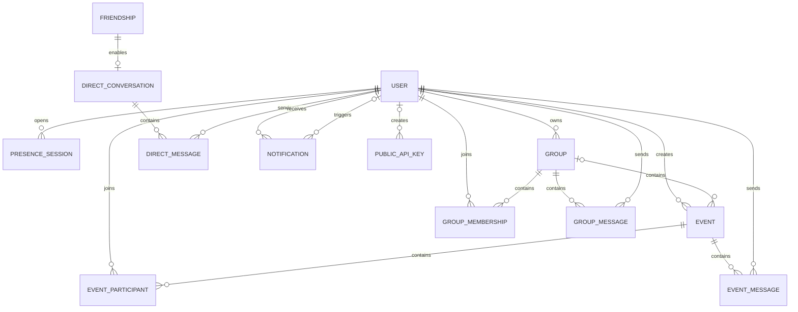

*This project has been created as part of the 42 curriculum by mhoushma, bhocsak, cjuarez, oshcheho, pghajard.*

# Vienna Active

Vienna Active is a multilingual social sports platform for discovering activities, creating events and groups, meeting other people in Vienna, and communicating in real time.

The project was developed as `ft_transcendence`, the final group project of the 42 Common Core.

## Description

Vienna Active brings local sports activities, groups, events, and social features into one responsive web application.

Users can:

- create an account using email and password or Google OAuth;
- manage a public sports profile and avatar;
- discover and filter events;
- search for events on an interactive map;
- create, edit, join, and leave events;
- join sports groups and participate in group events;
- send and manage friend requests;
- exchange direct, group, and event messages;
- see online presence and last-seen information;
- receive real-time notifications; and
- switch between English, German, and Ukrainian.

The application consists of a React frontend, a Django REST backend, a PostgreSQL database, WebSocket communication through Django Channels, and an nginx HTTPS gateway. The complete evaluation stack runs through Docker Compose with a single `make` command.

## Key Features

### Authentication and profiles

- Email and password registration with backend and frontend validation
- Secure Django password hashing
- JWT access and refresh tokens
- Google OAuth 2.0/OpenID Connect login with PKCE
- Public profiles with avatars, biographies, districts, languages, and sports interests
- Profile editing
- Online presence and last-seen information
- User activity history
- English, German, and Ukrainian translations

### Events

- Create, view, edit, and delete sports events
- Public and group-private event visibility
- Event images
- Sports, skill levels, languages, dates, locations, and capacity
- Join, leave, waiting-list, and automatic promotion behavior
- Event participant lists
- Event chat
- Search, filtering, sorting, and pagination
- Upcoming and past event views

### Groups

- Create, edit, join, and leave sports groups
- MVP groups are public and open to join; legacy visibility/join-policy fields
  remain only for backwards-compatible migrations
- Group owners, administrators, and members
- Group member limits
- Group cover images and location information
- Group-specific events
- Member-only group chat
- Group and membership notifications

### Social features

- Search for other users
- Send, accept, reject, and remove friendship requests
- Block users
- Open public user profiles
- Direct messaging between accepted friends
- Persistent chat history
- Live WebSocket message delivery
- Presence indicators

### Notifications

Notifications are created for relevant social and application actions, including:

- friend requests and friendship changes;
- direct and group messages;
- group changes and membership activity;
- event creation, updates, deletion, and participation; and
- waiting-list promotion.

Notifications are available through the REST API and delivered to connected clients through WebSockets.

### Maps and locations

- Interactive map with event markers
- Event marker clustering and filtering
- Address autocomplete
- Reverse geocoding
- Vienna-focused location search
- MapTiler, Geoapify, and OpenStreetMap Nominatim provider support
- Cached geocoding results
- Light and dark map styles
- Event navigation from the map

### Public API

Vienna Active provides a read-only integration API with:

- administrator-issued API keys;
- hashed API-key storage;
- key revocation;
- per-key and per-IP rate limiting;
- pagination, filtering, searching, and ordering;
- OpenAPI schema generation;
- Swagger documentation; and
- public profile, event, group, sport, district, and health endpoints.

The Public API deliberately uses `GET` endpoints and excludes email addresses, authentication data, private events, memberships, and chats.

API documentation is available at:

```text
https://localhost/api/docs/
```

#### Authorizing a public API client

The public API uses API keys, not the JWT used by the signed-in application.
Keys are issued by an administrator from the backend container (or from a
local backend virtual environment):

```bash
# Evaluation/Docker stack, run from the repository root
docker compose exec backend python manage.py create_public_api_key \
  --name "evaluation client"

# Local backend, run from the backend directory
python manage.py create_public_api_key --name "local integration"
```

The command prints the raw key once. Save it immediately: only a salted
Django password hash and a short prefix are stored in PostgreSQL, so the raw
key cannot be recovered later. Revoke a key from Django administration at
`https://localhost/admin/` (or `http://localhost:8000/admin/` during local
development) and issue a replacement when necessary.

Use the key in the `X-API-Key` header for every public API request:

```bash
curl -k \
  -H "X-API-Key: tr_pub_<your-issued-key>" \
  "https://localhost/api/public/v1/events/?page=1&page_size=20"
```

The `-k` option is needed only for the self-signed HTTPS certificate in the
evaluation stack. The same request can be sent to
`http://localhost:8000/api/public/v1/` when Daphne is running locally.

Swagger has the same authentication flow: open `/api/docs/`, click
**Authorize**, select `PublicApiKeyAuth`, paste the raw key, and choose
**Authorize**. Do not add `Bearer` or any other prefix. Missing or invalid
keys are rejected; a revoked key returns an authentication error, and a
throttled client receives HTTP 429. The default limits are 60 requests per
minute per key and 120 requests per minute per source IP; configure them with
`PUBLIC_API_RATE` and `PUBLIC_API_IP_RATE`.

Collection responses are paginated as `{count, next, previous, results}`.
`page_size` is capped at 100. Events support `sport`, `level`, `language`,
`start_after`, `start_before`, `search`, and `ordering`; groups support
`sport`, `level`, `search`, and `ordering`; users support `search` and
`ordering`. The complete contract is maintained in
[backend/PUBLIC_API.md](backend/PUBLIC_API.md).

## Team Information

All five team members contributed as developers in addition to their assigned project role.

| 42 login | Role | Responsibilities |
| --- | --- | --- |
| `oshcheho` | Product Owner, Developer | Defined the product direction, prioritized features, validated application behavior, and led the core backend, database, API, social, event, map, notification, and testing work. |
| `bhocsak` | Project Manager / Scrum Master, Developer | Organized team work, tracked progress, supported testing and integration, coordinated branches and pull requests, and implemented event-card and event-details functionality. |
| `cjuarez` | Technical Lead, Developer | Supported architecture and technical decisions, implemented initial authentication and WebSocket foundations, added Google OAuth, validated the Makefile workflow, and maintained legal and project documentation. |
| `mhoushma` | Developer | Developed major frontend pages and reusable layout components, including the welcome experience, discovery interface, map UI, profiles, authentication screens, chats, header, sidebar, and footer. |
| `pghajard` | Developer | Developed the groups experience and logged-in home page, contributed shared frontend and API foundations, and containerized and documented the application deployment. |

## Project Management

### Organization

The project was divided into feature areas based on team ownership and experience.

Work was organized through:

- Git branches for isolated feature development;
- meaningful commits to document progress;
- pull requests for integration;
- branch review and merging;
- weekly in-person meetings to review progress and blockers; and
- Discord for day-to-day communication and coordination.

The Product Owner prioritized the application’s functional direction. The Project Manager coordinated work and integration. The Technical Lead supported architectural and security decisions. All members implemented, tested, reviewed, and documented features.

### Development workflow

A typical feature followed this process:

1. Discuss the feature and assign ownership.
2. Create or use a dedicated branch.
3. Implement the backend, frontend, or integration changes.
4. Test the feature locally.
5. Open or prepare the change for integration.
6. Review and merge the branch.
7. Resolve conflicts and verify the combined application.
8. Document important workflows and technical decisions.

## Technical Stack

### Frontend

| Technology | Purpose |
| --- | --- |
| React | Component-based user interface |
| TypeScript | Static typing for frontend state, APIs, and components |
| Vite | Frontend development and production build tooling |
| React Router | Client-side routing |
| Tailwind CSS and project CSS | Responsive layouts, reusable styling, and theming |
| i18next / react-i18next | English, German, and Ukrainian localization |
| Lucide React | Consistent interface icons |
| Leaflet-based map integration | Interactive maps, markers, controls, and event navigation |

React and TypeScript were selected to support reusable UI components and safer integration with the backend’s structured API responses. Vite provides a fast development environment and a compact production build.

### Backend

| Technology | Purpose |
| --- | --- |
| Python 3.12 | Backend runtime |
| Django | Application framework, authentication, ORM, migrations, and administration |
| Django REST Framework | REST API endpoints and serialization |
| Django Channels | WebSocket consumers and asynchronous communication |
| Daphne | ASGI HTTP and WebSocket server |
| Simple JWT | Application access and refresh tokens |
| Google Auth / Google Auth OAuthlib | OAuth 2.0 and OpenID Connect authentication |
| drf-spectacular | OpenAPI schema and Swagger documentation |
| psycopg2-binary | PostgreSQL database adapter |

Django was chosen because it combines authentication, database migrations, validation, administration, and a mature ORM. Django REST Framework provides consistent API permissions, serializers, validation, and testing utilities. Channels and Daphne allow REST and WebSocket traffic to share the same application and authentication model.

#### Backend responsibilities and API surface

The backend is one Django project split into domain applications. Each app
owns its models, migrations, serializers, permissions, views, and tests:

| Area | Main routes | Responsibility |
| --- | --- | --- |
| Accounts | `/api/auth/` | Email/password registration and login, JWT refresh, profile updates, and Google OAuth flow |
| Users and friendships | `/api/users/`, `/api/friends/` | Public profiles, activity/presence data, friend requests, blocking, and relationship actions |
| Events and groups | `/api/events/`, `/api/groups/` | CRUD, search/filtering/pagination, participation, group membership, group events, and event/group chat REST endpoints |
| Messaging and notifications | `/api/messages/`, `/api/notifications/` | Friend-only conversations, persistent messages, unread state, and notification history |
| Geography and catalogs | `/api/geo/`, `/api/meta/` | Address search/reverse geocoding, cached results, sports, and Vienna districts |
| External integrations | `/api/public/v1/` | Read-only API-key-protected resources documented with OpenAPI/Swagger |

WebSocket consumers are mounted under `/ws/` for event chat, group chat,
direct messages, presence, and real-time notifications. Signed-in REST and
WebSocket traffic uses the application JWT; the public integration API is
intentionally isolated and uses `X-API-Key` instead.

### Database

The project uses PostgreSQL 16.

PostgreSQL was chosen because:

- the subject requires multiple simultaneous users;
- it provides reliable transactions and concurrency;
- it enforces relational constraints;
- it supports indexed and structured JSON fields used for languages and interests;
- it is supported well by Django; and
- the same database engine is used in local development and Docker evaluation.

SQLite was used during early development but was replaced by PostgreSQL as the project’s only supported database.

### Infrastructure

| Technology | Purpose |
| --- | --- |
| Docker Compose | Single-command multi-container deployment |
| nginx | Public HTTPS entry point, TLS termination, reverse proxy, and media/static serving |
| Docker | Isolated frontend, backend, gateway, and database services |
| Make | Validated evaluation and development commands |
| Self-signed TLS certificate | Local HTTPS evaluation |
| PostgreSQL volume | Persistent database storage |
| Docker health checks | Controlled service startup |

Only nginx exposes host ports in the evaluation stack. Browser traffic uses HTTPS or WSS. Internal container communication remains on a private Docker network.

## Architecture

```text
Browser
   |
   | HTTPS / WSS
   v
nginx gateway
   |
   |-- /              --> React frontend
   |-- /api/          --> Django REST API
   |-- /ws/           --> Django Channels
   |-- /admin/        --> Django administration
   |-- /media/        --> uploaded media
   `-- /static/       --> collected static files

Django / Daphne
   |
   `-- PostgreSQL
```

The evaluation stack contains four services:

| Service | Responsibility |
| --- | --- |
| `nginx` | HTTPS termination and public reverse proxy |
| `frontend` | Builds and serves the React SPA |
| `backend` | Django REST APIs, WebSockets, migrations, static collection, and seeding |
| `db` | PostgreSQL database |

More detailed diagrams are available in [DOCKER.md](DOCKER.md) and [docs/docker/index.html](docs/docker/index.html).

## Database Schema

### Relationship overview



### Main tables

| Model | Important fields | Relationships and purpose |
| --- | --- | --- |
| `User` | UUID, username, email, password hash, district, bio, languages, interests, avatar, `google_sub`, `last_seen` | Central account and profile model |
| `PresenceSession` | UUID, connected time, last-seen time | Multiple live sessions belong to one user |
| `Event` | UUID, title, description, image, sport, level, languages, address, coordinates, dates, capacity, visibility | Created by a user and optionally associated with a group; group events may be private to that group |
| `EventParticipant` | status, queue position, joined time | Joins users to events and implements attendance/waiting lists |
| `Group` | UUID, name, description, sport, levels, capacity, languages, location, cover image, active state | Owned by a user and contains members, messages, and events; the MVP normalizes every group to public/open |
| `GroupMembership` | role, status, joined time | Joins users to groups with owner/admin/member roles; persisted memberships are active in the MVP |
| `Friendship` | two user references, requester, status | Stores one canonical relationship per pair of users |
| `Message` | UUID, sender, event, text, timestamp | Persistent event-chat message |
| `DirectConversation` | UUID, friendship, timestamps | Optional one-to-one conversation created for an accepted friendship |
| `DirectMessage` | UUID, conversation, sender, text, timestamp | Persistent direct message |
| `GroupMessage` | UUID, group, sender, text, timestamp | Persistent member-only group message |
| `Notification` | recipient, nullable actor, type, payload, target URL, read time | Records social, message, event, group, and membership notifications; system-generated notifications may have no actor |
| `GeocodeCache` | provider, query, language, coordinates, response, expiry, hit count | Caches address-search and reverse-geocoding results |
| `PublicAPIKey` | name, prefix, salted key hash, status, timestamps, nullable creator | Authenticates and rate-limits public API clients without storing raw keys |

Database constraints prevent duplicate event participation, duplicate group membership, duplicate friendship pairs, invalid self-friendships, and conflicting waiting-list positions.

Migrations in each Django app are the source of truth for the database schema.
`backend/fixtures/eval_snapshot.json` contains evaluation data only; it does
not replace migrations. The Docker entrypoint waits for PostgreSQL and applies
all migrations before optionally loading that fixture.

## Feature Ownership

Features evolved through collaboration and integration. The table lists the primary contributors rather than implying that every feature was developed in isolation.

| Feature | Functionality | Primary contributors |
| --- | --- | --- |
| Core backend, REST API, and database | Django models, serializers, permissions, migrations, validation, and API behavior | `oshcheho` |
| Email authentication | Registration, email login, password hashing, JWTs, district validation, and forms | `oshcheho`, `cjuarez` |
| Google OAuth | OAuth/OIDC authorization-code flow, PKCE, account linking, ID-token verification, one-time ticket exchange, and failure-path tests | `cjuarez` |
| Profiles and avatars | Editable profiles, image uploads, public profiles, preferences, presence, and activity history | `oshcheho`, `mhoushma` |
| Events | Event CRUD, participation, waiting lists, visibility, event chat, cards, details, and My Events | `oshcheho`, `bhocsak`, `mhoushma` |
| Groups | Group CRUD, memberships, group pages, group events, group chat, and group UI | `pghajard`, `oshcheho` |
| Friendships | Search, requests, accept/reject/remove/block actions, and profile links | `oshcheho` |
| Direct messaging | Friend-only conversations, persistence, REST endpoints, WebSockets, and UI | `oshcheho`, `mhoushma`, `cjuarez` |
| Group and event chat | Persistent messages, membership/participation permissions, WebSockets, and chat UI | `oshcheho`, `mhoushma`, `cjuarez` |
| Notifications | Friend, message, group, event, membership, read/unread, and WebSocket delivery | `oshcheho`, `pghajard` |
| Map and geocoding | Map UI, address search, reverse geocoding, caching, markers, filters, and event navigation | `oshcheho`, `mhoushma` |
| Welcome and discovery | Guest landing page, curated sections, filters, cards, and discovery experience | `mhoushma`, `bhocsak`, `pghajard` |
| Logged-in home | Greeting, upcoming events, joined groups, notifications, and quick links | `pghajard` |
| Header, sidebar, and footer | Navigation, responsive menu, search, language selection, theme controls, and legal links | `mhoushma`, `bhocsak` |
| Internationalization | English, German, and Ukrainian translations and language switching | `bhocsak`, `mhoushma`, `oshcheho`, `cjuarez` |
| Design system and theme | Reusable controls, cards, icons, colors, responsive layout, and dark/light mode | `bhocsak`, `mhoushma`, `pghajard` |
| Public API | API keys, hashing, revocation, throttling, serializers, pagination, OpenAPI, and Swagger | `oshcheho` |
| Docker and HTTPS deployment | Compose services, Dockerfiles, PostgreSQL, nginx, health checks, volumes, and diagrams | `pghajard`, `bhocsak` |
| Makefile workflow | Environment preparation and evaluation/development commands | `pghajard`, `cjuarez`, `bhocsak` |
| Testing | Authentication, OAuth, events, groups, social behavior, chats, notifications, geocoding, and public API | `oshcheho`, `bhocsak`, `cjuarez`, `pghajard` |
| Documentation | Architecture, workflows, APIs, Docker, OAuth, frontend components, legal pages, and root README | All members; coordinated by `cjuarez` |

## Chosen Modules

The team claims 20 module points.

| Category | Module | Type | Points | Implementation | Main contributors |
| --- | --- | ---: | ---: | --- | --- |
| Web | Framework for frontend and backend | Major | 2 | React/TypeScript frontend and Django/DRF backend | All |
| Web | Real-time features | Major | 2 | Channels/Daphne WebSockets for direct, event, and group chats, presence, and notifications | `oshcheho`, `cjuarez` |
| Web | User interaction | Major | 2 | Profiles, friendships, direct messages, group/event chats, and online status | `oshcheho`, `mhoushma`, `cjuarez` |
| Web | Public API | Major | 2 | API-key-protected read-only API with rate limiting, documentation, and more than five resource endpoints | `oshcheho` |
| Web | ORM | Minor | 1 | Django ORM, migrations, relations, constraints, and indexes | `oshcheho` |
| Web | Notification system | Minor | 1 | Persistent and real-time notifications for social, group, event, message, and membership actions | `oshcheho`, `pghajard` |
| Web | Advanced search | Minor | 1 | Search, filters, ordering, and pagination for events, groups, users, and public API resources | `oshcheho`, `mhoushma` |
| Web | Custom design system | Minor | 1 | Shared buttons, icon buttons, badges, headings, dialogs, pagination, cards, inputs, themes, typography, and icons | `bhocsak`, `mhoushma`, `pghajard` |
| Accessibility and Internationalization | Multiple languages | Minor | 1 | English, German, and Ukrainian translations with a UI language switcher | `bhocsak`, `mhoushma`, `oshcheho`, `cjuarez` |
| Accessibility and Internationalization | Additional browsers | Minor | 1 | Modern Chrome, Firefox, Edge, Safari, and iOS Safari compatibility target and documented smoke-test matrix | All |
| User Management | Standard user management | Major | 2 | Secure registration/login, profile editing, avatars, friends, profiles, presence, and online status | `oshcheho`, `mhoushma` |
| User Management | OAuth 2.0 | Minor | 1 | Google OAuth 2.0 and OpenID Connect with PKCE and secure local-account linking | `cjuarez` |
| Module of choice | Interactive map and location system | Major | 2 | Event map, address search, reverse geocoding, multiple providers, cache, filters, marker semantics, and theme-aware tiles | `oshcheho`, `mhoushma` |
| Module of choice | Dark/light theme | Minor | 1 | Persistent theme selection, reusable color tokens, responsive components, and matching map styles | `bhocsak`, `mhoushma` |
|  | **Total** |  | **20** |  |  |

### Module-of-choice justification: map and location system

The map module adds substantial value because event discovery depends on physical location. It is more than a visual map embed: the implementation coordinates frontend map state with backend event data, address autocomplete, reverse geocoding, multiple provider formats, Vienna-focused search, cached results, event filters, marker behavior, responsive panels, geolocation permissions, and theme-aware tiles.

Its technical challenges include normalizing different geocoding APIs, limiting unnecessary external requests, keeping addresses and coordinates consistent, and connecting map interactions to event navigation.

### Module-of-choice justification: dark/light theme

The theme module improves usability across lighting conditions and demonstrates a reusable design-token approach. Theme selection is persisted in the browser and applied consistently to layouts, controls, text, surfaces, icons, responsive navigation, and map tiles.

## Individual Contributions

### `oshcheho` — Product Owner and Developer

Primary contributions:

- product direction, feature prioritization, and completed-work validation;
- complete Django backend, REST API, database models, migrations, permissions, and serializers;
- email authentication, form validation, avatar upload, and presence status;
- event and participation workflows;
- group, membership, and group-event backend behavior;
- user search, friendship requests, accept/reject/remove/block actions, and profile links;
- direct messaging, group chat, event chat, and WebSocket communication;
- notifications for friendships, messages, groups, events, and memberships;
- API-key-protected Public API with rate limiting and Swagger/OpenAPI documentation;
- map address search, geocoding cache, marker behavior, and location integration;
- profile preferences, activity history, and media upload support;
- backend and integration tests;
- API and workflow documentation.

A central challenge was keeping permissions and data visibility consistent across profiles, friendships, chats, groups, and private events. This was addressed with service-layer validation, scoped querysets, serializer separation, database constraints, and privacy-focused API tests.

### `bhocsak` — Project Manager / Scrum Master and Developer

Primary contributions:

- project organization and weekly coordination;
- branch, pull-request, merge, and conflict-resolution support;
- testing and integration checks;
- EventCard and EventDetailsPage implementation and refinement;
- event badges, participant displays, action visibility, and card sizing;
- Happening Now and live-event sections;
- shared button, badge, header-navigation, and route work;
- initial internationalization setup;
- dark-mode implementation and refinement;
- nginx and Makefile deployment fixes.

A recurring challenge was integrating event UI changes across branches while keeping cards, event details, translations, and permissions consistent. This was handled through pull requests, merge-conflict resolution, shared components, and repeated UI fixes.

### `cjuarez` — Technical Lead and Developer

Primary contributions:

- technical guidance and architecture support;
- initial account/login and WebSocket chat foundations;
- Google OAuth 2.0/OpenID Connect implementation;
- OAuth state, PKCE, verified identity, account linking, and one-time ticket security;
- focused Google OAuth success and failure-path tests;
- OAuth error handling for authentication, provider, and network failures;
- Privacy Policy and Terms of Service pages in three languages;
- Makefile validation;
- Google OAuth documentation;
- root README and evaluation documentation.

A major challenge was integrating Google authentication without exposing provider credentials or weakening the application’s JWT login model. This was solved with backend-only code exchange, verified ID tokens, stable Google subject identifiers, short-lived single-use tickets, and mocked integration tests covering replay and provider failures.

### `mhoushma` — Developer

Primary contributions:

- logged-out welcome and landing experience;
- Discover header and discovery-page presentation;
- responsive header, sidebar, footer, user menu, search, and language-switching components;
- map page UI, filters, controls, event detail panel, and responsive layout;
- profile page, profile side navigation, edit forms, and activity presentation;
- login and registration page UI;
- chats page design and chat presentation;
- Curated for You and Happening Now sections;
- reusable frontend components;
- translations and responsive styling.

A major challenge was turning several page concepts into a consistent responsive application rather than isolated mockups. This was addressed by extracting shared components, documenting component ownership, moving page-specific CSS into focused files, and integrating i18n throughout the UI.

### `pghajard` — Developer

Primary contributions:

- groups pages, group cards, group details, membership UX, and group-event RSVP;
- logged-in home page with greeting, notifications, groups, events, and quick links;
- early shared API client and authentication/event API integration;
- early application shell and page foundations;
- Dockerfiles and Docker Compose deployment;
- nginx HTTPS gateway and private container network;
- PostgreSQL integration and seed workflow;
- service health checks and persistent volumes;
- Makefile commands and local/evaluation workflows;
- Docker architecture diagrams and deployment documentation;
- sample users, groups, events, and default images.

A major challenge was making local development and evaluation use the same PostgreSQL-backed application while keeping the evaluation startup simple. This was solved with separate Compose overlays, health checks, migrations, conditional seed loading, persistent volumes, and a single root `make` command.

## Instructions

### Prerequisites

For the evaluation deployment, install:

- Docker Engine;
- Docker Compose v2 (`docker compose`) or the legacy `docker-compose` command;
- GNU Make;
- a recent Google Chrome version; and
- free host ports `80` and `443`.

No local Node.js, Python, or PostgreSQL installation is required for the Docker evaluation stack.

For local frontend development, Node.js 20.19 or newer is required. The production frontend container uses Node.js 22.

### Environment configuration

The repository provides `.env.example`.

Running `make` creates `.env` automatically if it does not exist and replaces the placeholder Django `SECRET_KEY` with a generated value.

To prepare it manually:

```bash
cp .env.example .env
```

Do not commit `.env` or real credentials.

Optional map configuration:

```env
GEO_PROVIDER=auto
MAPTILER_API_KEY=
GEOAPIFY_API_KEY=
NOMINATIM_USER_AGENT=ft-transcendence/1.0
```

If MapTiler and Geoapify keys are empty, the backend can use Nominatim where supported.

Google login requires a Google Cloud OAuth client and these additional `.env` values:

```env
GOOGLE_OAUTH_CLIENT_ID=your-client-id
GOOGLE_OAUTH_CLIENT_SECRET=your-client-secret
GOOGLE_OAUTH_REDIRECT_URI=https://localhost/api/auth/google/callback/
FRONTEND_URL=https://localhost
```

The callback URI must exactly match the authorized redirect URI in Google Cloud.

Email/password authentication works without Google OAuth configuration.

### Start the complete evaluation stack

From the repository root:

```bash
make
```

Then open:

```text
https://localhost
```

The local certificate is self-signed. Chrome will show a warning; choose **Advanced** and continue to localhost.

The backend waits for PostgreSQL, applies migrations, collects static files, and loads the evaluation seed data when appropriate.

### Django Admin and public API keys

The evaluation gateway exposes Django Admin at:

```text
https://localhost/admin/
```

Create a superuser from the backend container when one is not already
available:

```bash
docker compose exec backend python manage.py createsuperuser
```

After logging in, existing public keys can be reviewed or revoked in the
**Public API Keys** section. Issue a new key from the backend container with:

```bash
docker compose exec backend python manage.py create_public_api_key \
  --name "evaluation client"
```

The raw key is printed only once. Save it immediately and send it as the
`X-API-Key` header; it cannot be recovered from the database later.

### Useful commands

```bash
make help       # Show available commands
make ps         # Show container status
make logs       # Follow logs
make restart    # Restart running services
make down       # Stop containers and preserve volumes
make re         # Rebuild containers and preserve database volumes
make clean      # Remove containers and preserve volumes
make fclean     # Remove containers and delete Compose volumes
make seed       # Reset PostgreSQL to the committed evaluation snapshot
```

`make fclean` deletes the PostgreSQL volume and should be used only when a full data reset is intended.

### Local development

Start only PostgreSQL:

```bash
make db
```

Backend:

```bash
cd backend
python3 -m venv venv
source venv/bin/activate
pip install -r requirements.txt
python manage.py migrate
daphne -b 127.0.0.1 -p 8000 core.asgi:application
```

Frontend:

```bash
cd frontend
npm ci
npm run dev
```

Local development URLs:

```text
Frontend: http://localhost:5173
Backend:  http://localhost:8000
```

Do not run the local backend and Docker backend simultaneously because both may use the same database.

### Tests

Run all backend tests from `backend/`:

```bash
./venv/bin/python manage.py test -v 2
```

Run one application’s tests:

```bash
./venv/bin/python manage.py test accounts -v 2
./venv/bin/python manage.py test events -v 2
./venv/bin/python manage.py test groups -v 2
./venv/bin/python manage.py test chat -v 2
./venv/bin/python manage.py test social -v 2
./venv/bin/python manage.py test public_api -v 2
```

Validate the frontend:

```bash
cd frontend
npm ci
npm run build
```

## Evaluation Data

A fresh PostgreSQL volume is populated from:

```text
backend/fixtures/eval_snapshot.json
```

Sample accounts, events, groups, friendships, and images are provided for evaluation.

Known sample accounts are documented in [DOCKER.md](DOCKER.md).

## Resources

### Project documentation

- [Docker architecture](DOCKER.md)
- [Development and deployment workflow](DEVOPS.md)
- [Backend documentation](backend/README.md)
- [Frontend development guide](frontend/DEV.md)
- [Frontend architecture](FRONTEND_ARCHITECTURE.md)
- [Frontend design system](frontend/DESIGN_SYSTEM.md)
- [Browser support](frontend/BROWSER_SUPPORT.md)
- [Public API](backend/PUBLIC_API.md)
- [Social API](backend/SOCIAL_API.md)
- [Groups API](backend/groups/README.md)
- [Google OAuth](backend/accounts/GOOGLE_AUTH.md)
- [Sports catalog API](backend/core/SPORTS_API.md)

### External references

- [React documentation](https://react.dev/)
- [TypeScript documentation](https://www.typescriptlang.org/docs/)
- [Vite documentation](https://vite.dev/guide/)
- [Django documentation](https://docs.djangoproject.com/)
- [Django REST Framework documentation](https://www.django-rest-framework.org/)
- [Django Channels documentation](https://channels.readthedocs.io/)
- [PostgreSQL documentation](https://www.postgresql.org/docs/)
- [Docker documentation](https://docs.docker.com/)
- [nginx documentation](https://nginx.org/en/docs/)
- [Google OAuth 2.0 documentation](https://developers.google.com/identity/protocols/oauth2)
- [OpenID Connect](https://openid.net/developers/how-connect-works/)
- [i18next documentation](https://www.i18next.com/)
- [Leaflet documentation](https://leafletjs.com/reference.html)
- [OpenAPI specification](https://spec.openapis.org/oas/latest.html)

## Use of AI

AI tools were used as development assistants for:

- learning and understanding unfamiliar concepts;
- planning features and technical workflows;
- explaining framework and library behavior;
- suggesting test cases and helping write tests;
- reviewing documentation structure;
- improving technical documentation;
- generating design inspiration;
- producing default images; and
- preparing sample users, groups, and events.

AI-generated suggestions were reviewed, adapted, tested, and discussed by the team before being accepted. The team remained responsible for the resulting implementation and for understanding the code used in the project.

## Challenges and Solutions

### Concurrent users and real-time communication

The application needed to support several active users while maintaining private access to direct, group, and event conversations.

This was addressed with Django Channels, authenticated WebSocket consumers, scoped REST querysets, membership and friendship checks, persistent messages, presence sessions, and automated privacy tests.

### Event capacity and waiting lists

Concurrent participation can cause duplicate membership or queue-position conflicts.

The implementation uses PostgreSQL transactions, row locking where needed, uniqueness constraints, and explicit waiting-list promotion logic.

### Consistent permissions

Profiles, private events, friendships, group chats, and direct messages have different visibility rules.

Permissions are enforced in the backend rather than relying on hidden frontend controls. Tests verify that unauthorized users cannot access restricted data.

### Geocoding providers

MapTiler, Geoapify, and Nominatim return different response formats and may be unavailable or rate-limited.

The backend normalizes provider responses, caches results, validates coordinates, and provides controlled error handling.

### Docker and HTTPS

The browser, frontend, REST API, media, administration, and WebSockets needed to work through one HTTPS entry point.

nginx routes each path to the correct service, upgrades WebSocket connections, serves media and static files, and redirects HTTP to HTTPS. Health checks control startup order.

### Integration across feature branches

The project contained overlapping work in event cards, groups, navigation, translations, and backend integrations.

Weekly meetings, Discord communication, branches, pull requests, merge review, shared components, and integration testing were used to resolve conflicts and keep the application coherent.

## Known Limitations

- The TLS certificate is self-signed for local evaluation.
- Google OAuth requires a separately configured Google Cloud client.
- The in-memory Channels layer is intended for the single-backend evaluation deployment; a scaled multi-process deployment would require a shared channel layer such as Redis.
- Uploaded files and database data can be reset during development or evaluation.
- Account deletion and data export are not currently self-service features.
- The public API is read-only.
- Cross-browser smoke tests should be repeated on the exact browser versions used for release.
- Map and geocoding behavior depends on the configured third-party provider.

## License and Educational Use

Vienna Active was created for educational purposes as part of the 42 curriculum. Third-party libraries, images, map data, and services remain subject to their respective licenses and terms.
