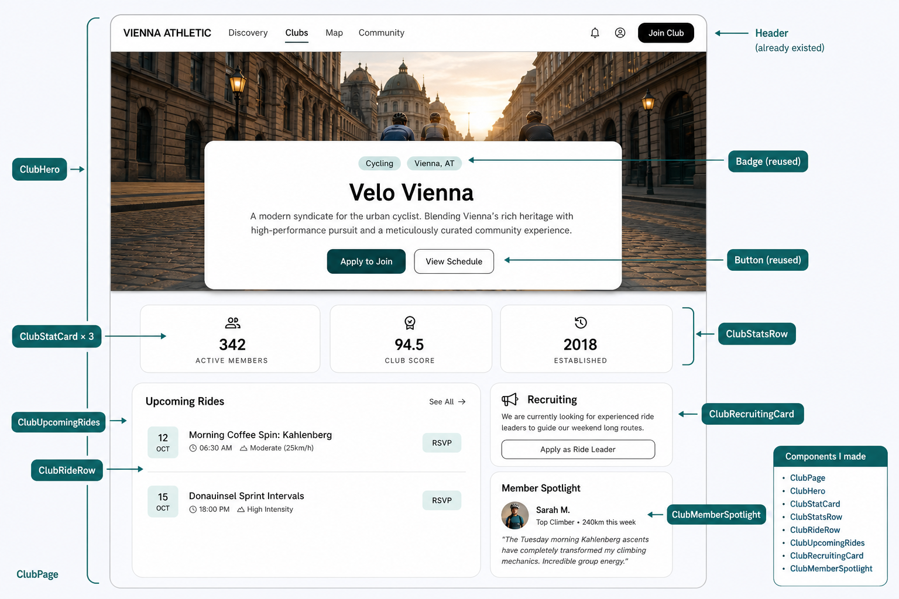

# Club Profile — Beginner Walkthrough

This guide explains the **Club Profile** screen to someone who does **not** know React or frontend yet.

Read it **top to bottom**. Each section builds on the previous one.

Related docs (more detail / code):

- `.local/CLUB_PROFILE_TASK.md` — task rules, acceptance checklist
- `.local/CLUB_PROFILE_CODE_WALKTHROUGH.md` — longer code-focused walkthrough

**Branch:** `feature/club-profile`  
**Developer:** Pouya  
**URL:** `http://localhost:5173/clubs`

---

## 0. The whole story in one minute

Someone clicks **Clubs** in the header (or opens `/clubs`).

Then this happens:

```text
Browser loads the website
        ↓
main.tsx starts React
        ↓
App.tsx sees the address /clubs
        ↓
ClubPage.tsx builds the Club screen
        ↓
ClubPage stacks smaller components:
  ClubHero
  ClubStatsRow (3 × ClubStatCard)
  ClubUpcomingRides (N × ClubRideRow)
  ClubRecruitingCard
  ClubMemberSpotlight
```

**Pouya’s task** was to build this whole Club screen on the frontend:

- create `ClubPage` and the club components
- add translations (`club.*`)
- add a small CSS layout fix
- connect the URL in `App.tsx` (`/clubs` → `ClubPage`)

**Important backend fact:** there is **no Club API**.  
Club name, stats, recruiting, and spotlight are **demo data**.  
Upcoming rides try to load real cycling **events**; if that fails, demo rides are shown.

---

## 1. Tiny dictionary (learn these words)

| Word | Plain meaning |
|------|----------------|
| **Frontend** | What the user sees in the browser |
| **Backend** | The server that stores and returns data |
| **Component** | A reusable piece of the screen |
| **Page** | A component for one full URL (like `/clubs`) |
| **Props** | Inputs given to a component |
| **State** | Data that can change while the page is open |
| **Import** | Bring code from another file |
| **`t("...")`** | Look up translated text |
| **Fake / demo data** | Hardcoded example content (no Club API yet) |
| **Reuse** | Use an existing shared piece instead of inventing a new one |

---

## 2. What kind of frontend this is

This project’s UI lives in `frontend/`.

- **React** — builds screens from components
- **TypeScript** — JavaScript with extra safety checks
- **Vite** — runs and builds the frontend

For this task you only need:

> Frontend draws the Club page. Most club identity text is demo data. Rides may come from the existing events API.

---

## 3. A small map of the frontend

```text
frontend/
├── index.html
├── package.json
└── src/
    ├── main.tsx                 ← starts the React app
    ├── app/App.tsx              ← connects URLs to pages
    ├── layouts/AppLayout.tsx    ← header + page area + footer
    ├── pages/ClubPage.tsx       ← the Club screen
    ├── components/
    │   ├── club/                ← Club pieces (created for this task)
    │   ├── shared/              ← Button, Badge (reused)
    │   └── layout/              ← Header, Sidebar, … (already existed)
    ├── api/eventsApi.ts         ← load/join events (reused for rides)
    ├── styles/global.css
    ├── utils/media.ts
    └── i18n/                    ← translations
```

---

## 4. How the app starts (`main.tsx`)

**File:** `frontend/src/main.tsx`

**Job:** turn on the React application (the **power button**).

```text
index.html has <div id="root"></div>
                ↓
main.tsx finds that box
                ↓
main.tsx renders App inside it
```

Wrappers around App:

```text
StrictMode
└── BrowserRouter     ← URLs like /clubs
    └── AuthProvider  ← login/user info
        └── App
```

### What to remember

- `main.tsx` starts everything.
- You did **not** need to change `main.tsx` for this Club task.

---

## 5. How `/clubs` is chosen (`App.tsx`)

**File:** `frontend/src/app/App.tsx`

**Job:** reception desk for URLs.

```text
User opens /clubs
        ↓
App.tsx checks the path
        ↓
App shows ClubPage
```

The important change for this task:

```tsx
import { ClubPage } from "../pages/ClubPage";

<Route path="clubs" element={<ClubPage />} />
```

Before this line, `/clubs` showed **Not Found**.  
After this line, `/clubs` shows the Club profile.

The header already linked to `/clubs`. This task made that link work — without rewriting the Header (to avoid teammate conflicts).

`AppLayout` still wraps the page:

```text
AppLayout
├── Header
├── ClubPage   ← appears here
└── Footer
```

### What to remember

| File | Responsibility |
|------|----------------|
| `main.tsx` | Start the app |
| `App.tsx` | Choose which page matches the URL |
| `ClubPage.tsx` | Build the Club screen |

---

## 6. The Club screen structure

**File:** `frontend/src/pages/ClubPage.tsx`

`ClubPage` is the **table of contents**. It does not draw every detail alone. It stacks smaller pieces:

```text
ClubPage
├── ClubHero
├── ClubStatsRow
│   └── ClubStatCard × 3
└── bento grid
    ├── ClubUpcomingRides
    │   └── ClubRideRow × N
    └── right column
        ├── ClubRecruitingCard
        └── ClubMemberSpotlight
```

### What `ClubPage` also does

Besides layout, it owns a bit of **data logic**:

1. Tries `getEvents({ sport: "cycling" })` for upcoming rides
2. If empty/error → uses demo rides from translations
3. Passes ride list into `ClubUpcomingRides`
4. Handles RSVP with `joinEvent` when a ride has a real `eventId`
5. Scrolls to rides when “View Schedule” is clicked

Club identity (name, stats, recruiting, spotlight) stays **demo / i18n**.

---

## 7. What Pouya built (and what was reused)

### Created

| File | One-sentence job |
|------|------------------|
| `pages/ClubPage.tsx` | Full `/clubs` page: data + layout |
| `components/club/ClubHero.tsx` | Cover image + name + badges + Apply / View Schedule |
| `components/club/ClubStatCard.tsx` | One stat tile |
| `components/club/ClubStatsRow.tsx` | Row of 3 stats |
| `components/club/ClubRideRow.tsx` | One ride line + RSVP |
| `components/club/ClubUpcomingRides.tsx` | Upcoming rides section |
| `components/club/ClubRecruitingCard.tsx` | “Looking for ride leaders” card |
| `components/club/ClubMemberSpotlight.tsx` | Member quote card |
| `components/club/CLUB.md` | Short ownership map for the team |
| `i18n` `club.*` keys (en / de / ua) | All visible club text |
| `global.css` (small addition) | Full-width club page layout |
| `App.tsx` (route line) | `/clubs` → `ClubPage` |

### Reused (already existed)

| Existing piece | Used for |
|----------------|----------|
| `Button` | Apply to Join, View Schedule, RSVP, Apply as Ride Leader |
| `Badge` | Sport / city pills, ride intensity |
| `Header` / `Footer` / `AppLayout` | Shared chrome around the page |
| `getEvents` / `joinEvent` | Load cycling events; RSVP real events |
| `resolveMediaUrl` / default images | Safe cover / avatar images |
| `useTranslation` / `t()` | All visible text |
| lucide-react icons | People, clock, megaphone, … |
| CSS variables | Theme / dark mode colors |

### Not part of this task

- Backend Club model / `/api/clubs/`
- Editing Header, Discover, Profile, or Map files (except the App route)
- Multi-club directory / real Apply-to-Join API

---

## 8. Best order to understand the club files

```text
1. ClubPage                 ← parent page
2. ClubHero                 ← top of the screen
3. ClubStatsRow + ClubStatCard
4. ClubUpcomingRides + ClubRideRow
5. ClubRecruitingCard
6. ClubMemberSpotlight
7. i18n + global.css + App route
```

---

## 9. Hero (`ClubHero`)

**File:** `frontend/src/components/club/ClubHero.tsx`

**Job:** the top of the Club page.

Shows:

```text
Cover photo
Glass / surface info card
  [ Cycling ] [ Vienna, AT ]     ← Badge (reused)
  Velo Vienna
  Short description
  [ Apply to Join ] [ View Schedule ]   ← Button (reused)
```

Props come from `ClubPage` (name, description, cover image, labels, click handlers).

“View Schedule” can scroll down to the rides section.  
“Apply to Join” is UI-only for now (no Club join API).

---

## 10. Stats (`ClubStatsRow` + `ClubStatCard`)

**Files:**

- `ClubStatCard.tsx` — one reusable tile
- `ClubStatsRow.tsx` — places three tiles

```text
ClubStatsRow
├── ClubStatCard  Active Members
├── ClubStatCard  Club Score
└── ClubStatCard  Established
```

Values are demo strings from translations (for example `342`, `94.5`, `2018`).

Pattern to remember:

> Build the small tile once (`ClubStatCard`), reuse it three times (`ClubStatsRow`).

---

## 11. Upcoming rides (`ClubUpcomingRides` + `ClubRideRow`)

**Files:**

- `ClubUpcomingRides.tsx` — section title + list
- `ClubRideRow.tsx` — one ride row

```text
ClubUpcomingRides
├── title “Upcoming Rides” + See All
└── ClubRideRow × N
      date | title | time | intensity Badge | RSVP Button
```

### Where ride data comes from

```text
ClubPage tries getEvents(sport: cycling)
        ↓
maps events into ride objects
        ↓
if none / error → demo rides from t("club.rides.…")
        ↓
passes list to ClubUpcomingRides
        ↓
.map() creates one ClubRideRow per ride
```

RSVP:

- real event with `eventId` → `joinEvent(id)`
- demo ride without `eventId` → no harmful backend call

---

## 12. Recruiting card (`ClubRecruitingCard`)

**File:** `frontend/src/components/club/ClubRecruitingCard.tsx`

**Job:** side card asking for ride leaders.

```text
Megaphone icon
Title + short text
[ Apply as Ride Leader ]   ← Button (reused)
```

Text from `t("club.recruiting.…")`.  
Apply is UI-only for now.

---

## 13. Member spotlight (`ClubMemberSpotlight`)

**File:** `frontend/src/components/club/ClubMemberSpotlight.tsx`

**Job:** show one member quote.

```text
Member Spotlight
Avatar + name + subtitle
Quote
```

Avatar uses `resolveMediaUrl` with a fallback default image.  
Content is demo data from translations / `ClubPage` props.

---

## 14. Supporting pieces

### Translations

All visible club text uses keys under `"club"` in:

- `frontend/src/i18n/locales/en.json`
- `frontend/src/i18n/locales/de.json`
- `frontend/src/i18n/locales/ua.json`

Example idea:

```text
t("club.hero.name")  →  "Velo Vienna"
```

### Global CSS

Small rules so the club cover can be full-width (similar idea to the Profile page).

### Shared tools

- `Button` / `Badge` — do not invent new button/pill styles
- `media.ts` — safe images
- `eventsApi.ts` — optional real rides + RSVP

---

## 15. Full chain (keep this diagram)

```text
frontend/index.html
  └─ #root
       ↓
frontend/src/main.tsx
  starts React + Router + Auth
       ↓
frontend/src/app/App.tsx
  path "clubs" → ClubPage
       ↓
frontend/src/pages/ClubPage.tsx
  loads ride data (API or demo)
  stacks club components
       ├── ClubHero
       │     ├── Badge (reused)
       │     └── Button (reused)
       ├── ClubStatsRow
       │     └── ClubStatCard × 3
       ├── ClubUpcomingRides
       │     └── ClubRideRow × N
       │           ├── Badge (reused)
       │           └── Button (reused)
       ├── ClubRecruitingCard
       │     └── Button (reused)
       └── ClubMemberSpotlight

Text → i18n club.* keys
Layout width → global.css club-page rules
```

---

## 16. How to explain your own work in 5 sentences

1. I built the **Club Profile** page for `/clubs` on branch `feature/club-profile`.
2. I created `ClubPage` plus hero, stats, rides, recruiting, and spotlight components.
3. Most club identity is **demo data** via translations, because there is no Club backend yet.
4. Upcoming rides try real cycling events from the existing API, with demo fallback.
5. I only minimally changed `App.tsx` so the existing Clubs nav link works.

---

## 17. What is finished vs later

### Done

- [x] `/clubs` shows the club profile
- [x] Hero, stats, rides, recruiting, spotlight
- [x] All visible text via `t("club.…")`
- [x] Theme via CSS variables
- [x] Shared `Button` + `Badge`
- [x] Backend untouched
- [x] Responsive layout

### Later / out of scope

- [ ] Real Club CRUD API
- [ ] Multi-club listing
- [ ] Real Apply to Join / Apply as Ride Leader network calls
- [ ] Editing Header “Join Club” wiring (avoided for conflict safety)

---

## 18. Suggested teaching order

1. Open `/clubs` in the browser.
2. `main.tsx` → “starts the app.”
3. `App.tsx` → “chooses ClubPage for `/clubs`.”
4. `ClubPage.tsx` → “table of contents + ride loading.”
5. `ClubHero.tsx` → top of the screen.
6. `ClubStatsRow` / `ClubStatCard` → numbers row.
7. `ClubUpcomingRides` / `ClubRideRow` → list built with `.map()`.
8. `ClubRecruitingCard` + `ClubMemberSpotlight` → right column.
9. Briefly show one `club.*` translation key and the App route line.

---

## 19. Picture of the Club screen (components I made)

Use this diagram when explaining the feature. It shows where each piece sits on `/clubs`.



### How to read the picture

| Label on the picture | File | What it is |
|----------------------|------|------------|
| **ClubPage** | `pages/ClubPage.tsx` | The whole `/clubs` screen |
| **ClubHero** | `components/club/ClubHero.tsx` | Cover + name + badges + CTAs |
| **ClubStatsRow** | `components/club/ClubStatsRow.tsx` | Row of three stats |
| **ClubStatCard × 3** | `components/club/ClubStatCard.tsx` | One reusable stat tile |
| **ClubUpcomingRides** | `components/club/ClubUpcomingRides.tsx` | Upcoming rides section |
| **ClubRideRow** | `components/club/ClubRideRow.tsx` | One ride line |
| **ClubRecruitingCard** | `components/club/ClubRecruitingCard.tsx` | Ride leader recruiting card |
| **ClubMemberSpotlight** | `components/club/ClubMemberSpotlight.tsx` | Member quote card |

Also marked (not created in this task):

- **Header** — already existed
- **Badge** / **Button** — reused shared components

Image file saved next to this doc:

`./club-profile-components-diagram.png`
