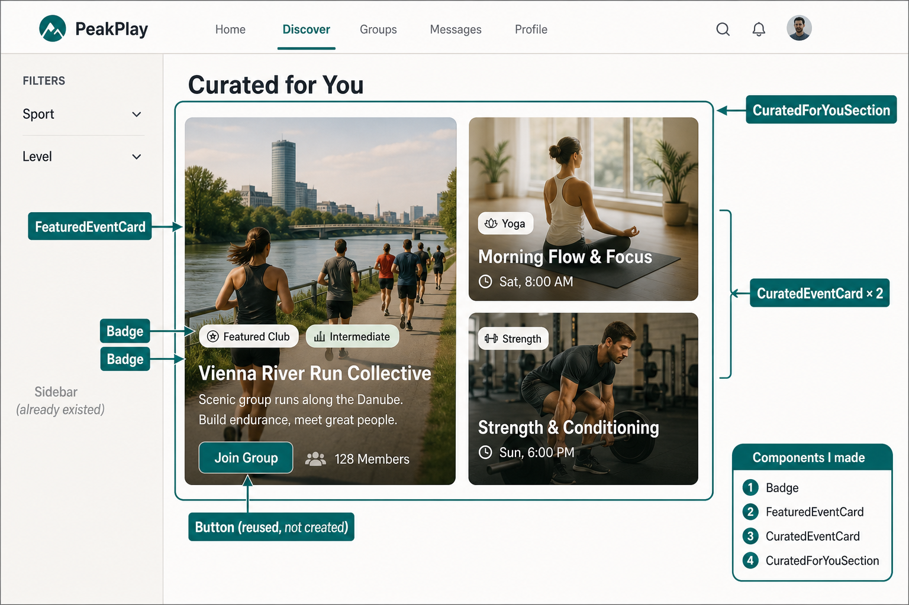

# Curated for You — Beginner Walkthrough

This guide explains the **“Curated for You”** Discover work to someone who does **not** know React or frontend yet.

Read it **top to bottom**. Each section builds on the previous one.

Related docs (more detail / code dumps):

- `.local/CURATED_FOR_YOU_TASK.md` — what was built, commits, full code
- `.local/CURATED_FOR_YOU_COMPONENTS.md` — created vs reused checklist

**Branch:** `feature/discover-curated-for-you`  
**Developer:** Pouya (Developer B)

---

## 0. The whole story in one minute

Someone opens:

```text
http://localhost:5173/discover
```

Then this happens:

```text
Browser loads the website
        ↓
main.tsx starts React
        ↓
App.tsx sees the address /discover
        ↓
DiscoverPage.tsx shows the Discover screen
        ↓
DiscoverMain.tsx fills the main area
        ↓
CuratedForYouSection.tsx shows “Curated for You”
        ↓
1 large card + 2 small cards appear
```

**Pouya’s task** was to build the curated section pieces:

- a shared `Badge`
- one large card (`FeaturedEventCard`)
- one small card (`CuratedEventCard`)
- the section that puts them together (`CuratedForYouSection`)
- translations + layout CSS

**Not Pouya’s job originally:** inventing `main.tsx`, inventing routing, or inventing the whole Discover page. Those already existed. Later, the section was connected into the Discover page through `DiscoverMain.tsx`.

---

## 1. Tiny dictionary (learn these 8 words)

| Word | Plain meaning |
|------|----------------|
| **Frontend** | The part of the app the user sees in the browser |
| **Backend** | The server that stores and returns data |
| **Component** | A reusable piece of the screen (button, card, badge, …) |
| **Page** | A component for one full URL screen (like `/discover`) |
| **Props** | Inputs given to a component (title, image, count, …) |
| **Import** | “Bring this code from another file so I can use it here” |
| **`t("...")`** | Look up translated text (English / German / Ukrainian) |
| **Fake / demo data** | Hardcoded example content used before real API data exists |

---

## 2. What kind of frontend this is

This project’s UI lives in `frontend/`.

- **React** — builds the screen from small components
- **TypeScript** — JavaScript with extra safety checks
- **Vite** — tool that runs and builds the frontend

Frontend and backend are separate. For this task you only need:

> Frontend draws the UI. Later it can ask the backend for real events. Right now curated cards use demo data.

---

## 3. A small map of the frontend

```text
frontend/
├── index.html              ← empty HTML shell with a “root” box
├── package.json            ← list of libraries
└── src/
    ├── main.tsx            ← starts the React app
    ├── app/App.tsx         ← connects URLs to pages
    ├── layouts/AppLayout.tsx ← header + page area + footer
    ├── pages/              ← full screens
    ├── components/         ← smaller reusable pieces
    ├── api/                ← talks to the backend
    ├── styles/global.css   ← shared styles
    ├── utils/media.ts      ← image helpers
    ├── types/              ← shapes of data
    └── i18n/               ← translations
```

You do **not** need backend folders for this explanation.

---

## 4. How the app starts (`main.tsx`)

**File:** `frontend/src/main.tsx`

**Job:** turn on the React application.

Think of it as the **power button**.

### What it does, simply

1. Finds the empty box named `root` in `frontend/index.html`
2. Puts the React app inside that box
3. Wraps the app with a few helpers
4. Opens `<App />`

```text
index.html has <div id="root"></div>
                ↓
main.tsx finds that box
                ↓
main.tsx renders App inside it
```

### The wrappers around App

```text
StrictMode          → helps catch some developer mistakes
└── BrowserRouter   → makes URLs like /discover work
    └── AuthProvider → makes login/user info available
        └── App     → the real application routes
```

### What to remember

- `main.tsx` **starts** everything.
- `main.tsx` does **not** draw Discover cards.
- You almost never edit `main.tsx` for a Discover UI task.

---

## 5. How `/discover` is chosen (`App.tsx`)

**File:** `frontend/src/app/App.tsx`

**Job:** reception desk for URLs.

```text
User opens /discover
        ↓
App.tsx checks the path
        ↓
App shows DiscoverPage
```

The important line:

```tsx
<Route path="discover" element={<DiscoverPage />} />
```

Meaning:

- if the path is `discover`
- show `frontend/src/pages/DiscoverPage.tsx`

Before that, App must import the page:

```tsx
import { DiscoverPage } from "../pages/DiscoverPage";
```

### AppLayout (one extra useful idea)

Most routes sit inside `AppLayout`:

```text
AppLayout
├── Header
├── current page (Outlet)   ← DiscoverPage appears here
└── Footer
```

So Discover is not a naked page. It appears under the shared header/footer.

### What to remember

| File | Responsibility |
|------|----------------|
| `main.tsx` | Start the app |
| `App.tsx` | Choose which page matches the URL |
| `DiscoverPage.tsx` | Build the Discover screen |

---

## 6. The Discover screen today

**File:** `frontend/src/pages/DiscoverPage.tsx`

This is the full Discover page.

Current visible structure:

```text
DiscoverPage
├── Sidebar                 (filters on the left)
└── DiscoverMain            (main content on the right)
      └── CuratedForYouSection
            ├── FeaturedEventCard      (large)
            └── CuratedEventCard × 2   (small)
```

### Why there is a `DiscoverMain`

The Discover page can grow (Happening Now, Curated for You, more sections later).

So the page is split:

- `DiscoverPage` = overall Discover screen (sidebar + main area)
- `DiscoverMain` = the right-side content stack
- `CuratedForYouSection` = one section inside that stack

Connection today:

```tsx
// DiscoverPage.tsx
<DiscoverMain />

// DiscoverMain.tsx
<CuratedForYouSection />
```

### Important about Pouya’s original task

Pouya built the curated **components**.  
Connecting them into the page (`DiscoverMain` / `DiscoverPage`) was planned as a later wiring step so people would not fight over the same page file.

On the current codebase, that wiring **already exists**.

---

## 7. What Pouya built (and what was reused)

### Created

| File | One-sentence job |
|------|------------------|
| `components/shared/Badge.tsx` | Small rounded label (“Yoga”, “Featured Club”) |
| `components/discover/FeaturedEventCard.tsx` | Large featured card |
| `components/discover/CuratedEventCard.tsx` | Small recommendation card |
| `components/discover/CuratedForYouSection.tsx` | Title + 1 large + 2 small cards |
| `i18n/locales/en.json` (+ de + ua) | Text for the section |
| `styles/global.css` (section classes) | Layout of the curated grid |

### Reused (already existed)

| Existing piece | Used for |
|----------------|----------|
| `Button` | “Join Group” on the large card |
| `resolveMediaUrl` / default image | Safe background images |
| `useTranslation` / `t()` | All visible text |
| `Users` icon (lucide-react) | Members icon |
| CSS variables (`--text`, `--surface`, …) | Theme-friendly colors |
| `BentoImageCard` | Visual inspiration only (not edited) |

### Not part of this task

- Backend / real event API for curated cards
- Happening Now section (another developer)
- Rebuilding the whole Discover page from scratch

---

## 8. Best order to understand the curated files

Do **not** start with random files. Use this order:

```text
1. CuratedForYouSection   ← parent: decides layout + data
2. FeaturedEventCard      ← large child card
3. CuratedEventCard       ← small child card
4. Badge                  ← tiny shared label used by both cards
5. Button / media / i18n / CSS  ← helpers around them
```

Why this order?

- The section is what users eventually see as one block.
- Cards are visual pieces fed by that section.
- Badge is a tiny shared tool used inside the cards.

If you prefer “smallest first,” reverse it: Badge → cards → section. Both work. Below we use **parent → children**, because it matches the screen.

---

## 9. The section parent (`CuratedForYouSection`)

**File:** `frontend/src/components/discover/CuratedForYouSection.tsx`

**Job:** create the whole “Curated for You” block.

### What it shows

```text
Curated for You                 ← section title
┌──────────────────┬──────────┐
│  LARGE CARD      │ small 1  │
│  FeaturedEvent   │──────────│
│                  │ small 2  │
└──────────────────┴──────────┘
```

### What it does in plain language

1. Gets the translation helper: `t(...)`
2. Builds a small list of demo events (`curatedEvents`)
3. Renders:
   - one `FeaturedEventCard`
   - two `CuratedEventCard`s using `.map()`

`.map()` means:

> For each item in the list, create one small card.

### Where the text comes from

Not hardcoded English in the JSX for user-facing labels. Example idea:

```text
t("discover.curatedForYou")  →  "Curated for You"
t("discover.yoga")           →  "Yoga"
```

Those keys live in:

- `frontend/src/i18n/locales/en.json`
- `frontend/src/i18n/locales/de.json`
- `frontend/src/i18n/locales/ua.json`

### Important current fact

This section uses **demo data** (hardcoded titles/images/member count).  
It does **not** call the backend yet. That is intentional for this task.

### What to remember

`CuratedForYouSection` is the **organizer**.  
It chooses the content and places the cards. The cards only decide how one card looks.

---

## 10. The large card (`FeaturedEventCard`)

**File:** `frontend/src/components/discover/FeaturedEventCard.tsx`

**Job:** draw one large featured card from props.

### Props it receives

| Prop | Meaning |
|------|---------|
| `image` | Background photo |
| `title` | Main name |
| `description` | Short text under the title |
| `levelLabel` | Second badge text (e.g. Intermediate) |
| `memberCount` | Number of members |
| `onJoin` | Optional click action for the button |
| `className` | Optional extra styling |

### What appears on the card

```text
Background image
Dark gradient overlay
[ Featured Club ] [ Intermediate ]
Title
Description
[ Join Group ]          👥 128 Members
```

### Who provides the data?

Usually `CuratedForYouSection`:

```text
CuratedForYouSection
        ↓ gives image/title/description/...
FeaturedEventCard
        ↓ draws them
```

### Helpers it uses

- `Badge` → the two pills
- `Button` → Join Group
- `resolveMediaUrl` → if image is missing, use a default
- `t("discover.featuredClub")`, `t("discover.joinGroup")`, `t("discover.members")`

### What to remember

This card does **not** choose which event is featured.  
It only receives data and displays it.

Also: if `onJoin` is not provided, the button is visual only for now.

---

## 11. The small card (`CuratedEventCard`)

**File:** `frontend/src/components/discover/CuratedEventCard.tsx`

**Job:** draw one small side card from props.

### Props it receives

| Prop | Meaning |
|------|---------|
| `image` | Background photo |
| `title` | Event name |
| `categoryLabel` | Badge text (e.g. Yoga) |
| `timeLabel` | Time/date line |
| `className` | Optional extra styling |

### What appears on the card

```text
Background image
Slight dark overlay
Glass box near the bottom:
  [ Yoga ]
  Morning Flow & Focus
  Sat, 8:00 AM
```

### Difference from the large card

| Feature | Large card | Small card |
|---------|------------|------------|
| Size | Large | Small |
| Badges | 2 | 1 |
| Description | Yes | No |
| Members | Yes | No |
| Button | Yes | No |
| Time line | No | Yes |

### What to remember

Same idea as the large card: **receive data → display data**.  
No backend call inside this file.

---

## 12. The shared Badge (`Badge`)

**File:** `frontend/src/components/shared/Badge.tsx`

**Job:** one reusable rounded label for many screens.

Examples:

```text
[ Featured Club ]
[ Intermediate ]
[ Yoga ]
```

### Props

| Prop | Meaning |
|------|---------|
| `children` | Text inside the badge |
| `variant` | Look: `default`, `live`, or `solid` |
| `className` | Optional extra spacing/style |

Example usage:

```tsx
<Badge>Yoga</Badge>
<Badge variant="live">Live</Badge>
```

### Why it is in `shared/`

Because more than one feature needs the same pill style (Discover cards, later Live cards, Club page, etc.). Build once, reuse everywhere.

### What to remember

Badge is a tiny tool. Cards use it. Badge does not know about events.

---

## 13. Supporting pieces around the cards

### A) Button (reused)

**File:** `frontend/src/components/shared/Button.tsx`

Used on the large card for “Join Group”.  
Rule of the project: do not invent raw `<button>` styles for this.

### B) Media helper (reused)

**File:** `frontend/src/utils/media.ts`

```text
resolveMediaUrl(image, DEFAULT_EVENT_IMAGE_SRC)
```

Meaning:

1. try the given image
2. if missing/invalid path handling needs a fallback, use the default event image

### C) Translations (edited)

Keys under `"discover"` in:

- `en.json`
- `de.json`
- `ua.json`

Examples: section title, featured title/description, small card titles/times, “Join Group”, “Members”.

### D) Layout CSS (edited)

**File:** `frontend/src/styles/global.css`

Classes like:

- `.curated-for-you`
- `.curated-for-you__title`
- `.curated-for-you__grid`
- `.curated-for-you__side`

These place the large card and the two small cards in a responsive grid:

- phone: stacked vertically
- wide screen: large card left, small cards right column

---

## 14. Full chain (keep this diagram)

```text
frontend/index.html
  └─ #root
       ↓
frontend/src/main.tsx
  starts React + Router + Auth
       ↓
frontend/src/app/App.tsx
  path "discover" → DiscoverPage
       ↓
frontend/src/pages/DiscoverPage.tsx
  Sidebar + DiscoverMain
       ↓
frontend/src/components/discover/DiscoverMain.tsx
  renders CuratedForYouSection
       ↓
frontend/src/components/discover/CuratedForYouSection.tsx
  demo data + layout
       ├── FeaturedEventCard
       │     ├── Badge
       │     ├── Button
       │     └── media helper
       └── CuratedEventCard × 2
             ├── Badge
             └── media helper

Text comes from i18n JSON files.
Grid layout comes from global.css.
```

---

## 15. How to explain your own work in 5 sentences

1. I worked on the Discover page’s **Curated for You** section.
2. I created a shared **Badge**, a **large featured card**, a **small curated card**, and a **section** that combines them.
3. The section currently uses **demo data** and translation keys, not a real curated API yet.
4. The app already had `main.tsx` and `App.tsx`; those start the app and route `/discover` to `DiscoverPage`.
5. The section is shown on Discover through `DiscoverMain`.

---

## 16. What is finished vs not finished

### Done in this feature work

- [x] Shared `Badge`
- [x] `FeaturedEventCard`
- [x] `CuratedEventCard`
- [x] `CuratedForYouSection`
- [x] EN / DE / UA keys for the demo content
- [x] Section layout CSS
- [x] No raw buttons / no hardcoded theme colors / cards reused with `.map()`

### Later / outside the original component task

- [ ] Real backend data instead of fake demo content
- [ ] Real Join action wired to an API (if needed)
- [ ] Happening Now section (other developer)

---

## 17. Suggested teaching order (if you walk someone through the code)

1. Show `/discover` in the browser.
2. Open `main.tsx` → “this starts the app.”
3. Open `App.tsx` → “this chooses DiscoverPage for `/discover`.”
4. Open `DiscoverPage.tsx` → “sidebar + main.”
5. Open `DiscoverMain.tsx` → “main content stack.”
6. Open `CuratedForYouSection.tsx` → “this is my section.”
7. Open `FeaturedEventCard.tsx` and `CuratedEventCard.tsx` → “these are the cards.”
8. Open `Badge.tsx` → “shared label used by the cards.”
9. Briefly show one translation key and the CSS grid classes.

That order matches how the screen is actually assembled.

---

## 18. Picture of the Discover screen (components I made)

Use this diagram when explaining the feature. It shows where each piece sits on `/discover`.



### How to read the picture

| Label on the picture | File | What it is |
|----------------------|------|------------|
| **CuratedForYouSection** | `components/discover/CuratedForYouSection.tsx` | The whole “Curated for You” block (title + grid) |
| **FeaturedEventCard** | `components/discover/FeaturedEventCard.tsx` | The large card on the left |
| **CuratedEventCard × 2** | `components/discover/CuratedEventCard.tsx` | The two small cards on the right (same component, used twice) |
| **Badge** | `components/shared/Badge.tsx` | The small pills on the cards (“Featured Club”, “Yoga”, …) |

Also marked on the picture (not created in this task):

- **Sidebar** — already existed
- **Button** — reused shared `Button` for “Join Group”

Image file saved next to this doc:

`./curated-for-you-components-diagram.png`
