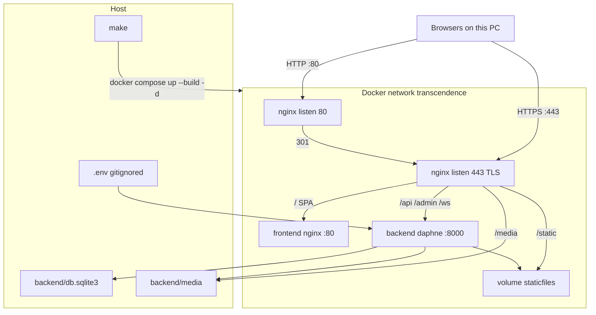
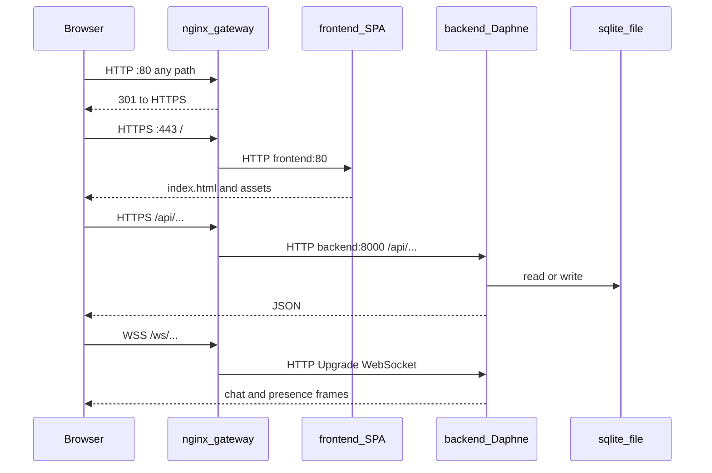
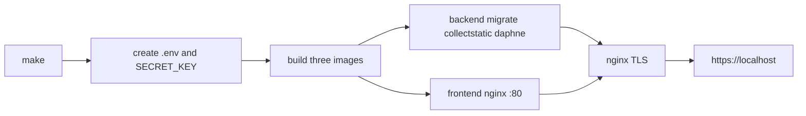
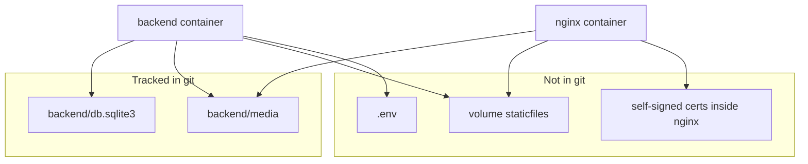

# Docker architecture

Mandatory container deployment for Active Vienna. This is not an extra DevOps module.

Eval command: `make` from the repository root. Stop with `make down`. Open **https://localhost** and accept the self-signed certificate warning.

Daily commands and troubleshooting: [DEVOPS.md](DEVOPS.md).

## Overview

Three containers share a private bridge network named `transcendence`. **Only nginx publishes ports** (`80` and `443`). The frontend and backend have no host ports. SQLite is a file bind-mounted into the backend, not a fourth container.

## Request path

The browser never talks to Daphne or the SPA nginx directly. Everything goes through the gateway.

## Containers

| Service | Image | Host ports | Main process | Role |
| --- | --- | --- | --- | --- |
| `nginx` | `nginx:1.27-alpine` + OpenSSL | `80`, `443` | `nginx` foreground | TLS, reverse proxy |
| `frontend` | Node 22 build, then `nginx:1.27-alpine` | none | `nginx` foreground | Serves the Vite `dist` SPA |
| `backend` | `python:3.12-slim` + Daphne | none | `daphne -b 0.0.0.0 -p 8000` | Django HTTP API and WebSockets |

Startup order: Compose waits until `backend` and `frontend` are **healthy**, then starts `nginx`.

Each service uses `init: true`, `restart: unless-stopped`, and `exec` so the real process receives SIGTERM. A crash exits the container; Compose starts it again.

## Gateway routing

Defined in [nginx/nginx.conf](nginx/nginx.conf):

| Browser path | Where it goes | Protocol |
| --- | --- | --- |
| any on port 80 | same URL on 443 | HTTP 301 |
| `/` and SPA assets | `http://frontend:80` | HTTP inside Docker |
| `/api/`, `/admin/` | `http://backend:8000` | HTTP inside Docker |
| `/ws/` | `http://backend:8000` with `Upgrade` | WebSocket inside Docker |
| `/static/` | volume `staticfiles` | files on disk |
| `/media/` | host `backend/media` | files on disk |

Internal HTTP is allowed by the subject. Browsers only use HTTPS (and WSS).

The frontend image is built with `VITE_API_URL=https://localhost` and `VITE_WS_URL=wss://localhost`, so the SPA calls the gateway, not Vite `:5173`.

## Data on the host

- **SQLite** is the database. Bind-mounted so Docker and local Daphne share the same file. Commit it (after stopping the backend) if teammates should see new events/chats/groups.
- **Media** is user uploads. Bind-mounted read-write on backend, read-only on nginx.
- **staticfiles** is Django `collectstatic` output (admin CSS). Named volume, rebuilt on start.
- **TLS** is a self-signed cert created at nginx start (`CN=localhost`, SAN `localhost` and `127.0.0.1`). Chrome shows `ERR_CERT_AUTHORITY_INVALID` until you click Advanced → Proceed.

There is no Postgres or Redis container. One Daphne process uses the in-memory channel layer, which is enough for several browsers on this PC.

## Files

| Path | Purpose |
| --- | --- |
| [Makefile](Makefile) | `make` / `make down` / `make logs` / `make ps` |
| [docker-compose.yml](docker-compose.yml) | Services, network, volumes, healthchecks |
| [nginx/](nginx/) | Gateway image, TLS entrypoint, routing |
| [frontend/Dockerfile](frontend/Dockerfile) | Production SPA image |
| [backend/Dockerfile](backend/Dockerfile) | Daphne image, migrate on start |
| [.env.example](.env.example) | Template; real `.env` is gitignored |
