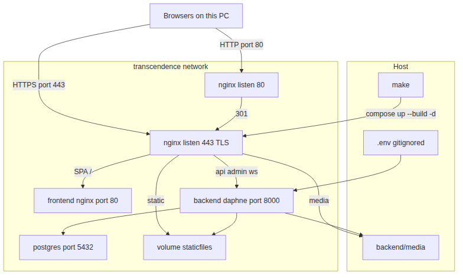
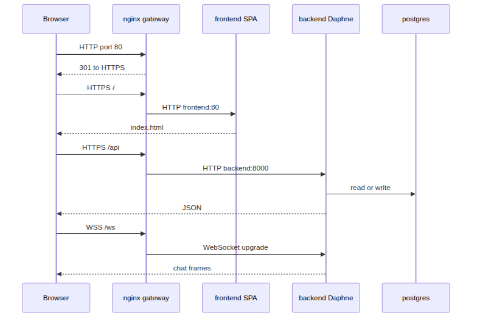
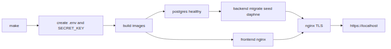
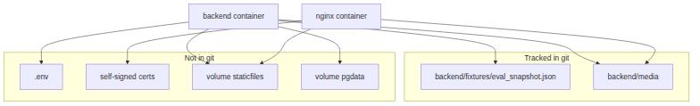

# Docker architecture

Mandatory container deployment for Active Vienna. This is not an extra DevOps module.

**To see the graphs:** open [docs/docker/index.html](docs/docker/index.html) in Chrome, or open the PNG files under [docs/docker/](docs/docker/). The `.md` source in the editor is only text.

Eval command: `make`. Stop with `make down`. Open **https://localhost** and accept the self-signed certificate warning.

Daily coding: `make db`, then local Daphne + Vite. Details: [DEVOPS.md](DEVOPS.md).

## Overview

Four containers share a private bridge network named `transcendence`. **Only nginx publishes ports** (`80` and `443`) on the eval stack. The frontend, backend, and Postgres have no host ports then. Daily `make db` publishes Postgres on `localhost:5432` so Vite/Daphne can use the same database.

## Request path

The browser never talks to Daphne or the SPA nginx directly during eval. Everything goes through the gateway.

1. Port 80 only redirects to HTTPS.
2. `/` is the React SPA from the frontend container.
3. `/api/` and `/admin/` go to Daphne.
4. `/ws/` is upgraded to a WebSocket for chat and presence.

## Containers

| Service | Image | Host ports | Main process | Role |
| --- | --- | --- | --- | --- |
| `nginx` | `nginx:1.27-alpine` + OpenSSL | `80`, `443` | `nginx` foreground | TLS, reverse proxy |
| `frontend` | Node 22 build, then `nginx:1.27-alpine` | none | `nginx` foreground | Serves the Vite `dist` SPA |
| `backend` | `python:3.12-slim` + Daphne | none | `daphne -b 0.0.0.0 -p 8000` | Django HTTP API and WebSockets |
| `db` | `postgres:16-alpine` | none on eval; `5432` with `make db` | `postgres` | Database |

Startup order: Compose waits until `db` is healthy, then `backend` migrates and seeds if empty, then `nginx` starts after backend and frontend are healthy.

## Gateway routing

Defined in [nginx/nginx.conf](nginx/nginx.conf):

| Browser path | Where it goes | Protocol |
| --- | --- | --- |
| any on port 80 | same URL on 443 | HTTP 301 |
| `/` and SPA assets | `http://frontend:80` | HTTP inside Docker |
| `/api/`, `/admin/` | `http://backend:8000` | HTTP inside Docker |
| `/ws/` | `http://backend:8000` with `Upgrade` | WebSocket inside Docker |
| `/static/` | volume `staticfiles` | files on disk |
| `/media/` | host `backend/media` | files on disk |

Internal HTTP is allowed by the subject. Browsers only use HTTPS (and WSS).

The frontend image is built with `VITE_API_URL=https://localhost` and `VITE_WS_URL=wss://localhost`, so the SPA calls the gateway, not Vite `:5173`.

## Data on the host

- **PostgreSQL** lives in the `pgdata` named volume. It is not in git. A fresh volume is seeded from [backend/fixtures/eval_snapshot.json](backend/fixtures/eval_snapshot.json).
- **Media** is user uploads. Bind-mounted read-write on backend, read-only on nginx.
- **staticfiles** is Django `collectstatic` output (admin CSS). Named volume, rebuilt on start.
- **TLS** is a self-signed cert created at nginx start. Chrome shows `ERR_CERT_AUTHORITY_INVALID` until you click Advanced → Proceed.

There is no Redis container. One Daphne process uses the in-memory channel layer, which is enough for several browsers on this PC.

Known snapshot logins: `alex@example.com` / `testpass123` and `carlito@example.com` / `12345678`.

## Files

| Path | Purpose |
| --- | --- |
| [Makefile](Makefile) | `make` / `make db` / `make seed` / `make down` |
| [docker-compose.yml](docker-compose.yml) | Eval services, private network, volumes, healthchecks |
| [docker-compose.dev.yml](docker-compose.dev.yml) | Publishes Postgres `5432` for daily work |
| [nginx/](nginx/) | Gateway image, TLS entrypoint, routing |
| [docs/docker/index.html](docs/docker/index.html) | Diagrams in a browser |
| [docs/docker/](docs/docker/) | PNG graphs and Mermaid sources |
