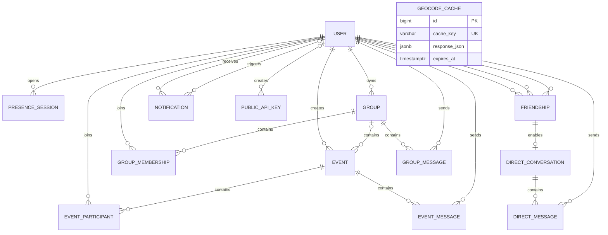

*This project has been created as part of the 42 curriculum by mhoushma, bhocsak, cjuarez, oshcheho, pghajard.*

# Vienna Active

Vienna Active is a multilingual social sports platform for discovering activities, creating events and groups, meeting other people in Vienna, and communicating in real time.

The project was developed as `ft_transcendence`, the final group project of the 42 Common Core.

## Table of Contents

- [Description](#description)
- [Key Features](#key-features)
- [Team Information](#team-information)
- [Project Management](#project-management)
- [Technical Stack](#technical-stack)
- [Architecture](#architecture)
- [Database Schema](#database-schema)
- [Feature Ownership](#feature-ownership)
- [Chosen Modules](#chosen-modules)
- [Individual Contributions](#individual-contributions)
- [Instructions](#instructions)
- [Evaluation Data](#evaluation-data)
- [Resources](#resources)
- [Use of AI](#use-of-ai)
- [Challenges and Solutions](#challenges-and-solutions)
- [Known Limitations](#known-limitations)
- [License and Educational Use](#license-and-educational-use)

## Description

Vienna Active brings local sports activities, groups, events, and social features into one responsive web application.

Users can:

- create an account using email and password or Google OAuth;
- manage a public sports profile and avatar;
- discover and filter events;
- search for events on an interactive map;
- create, edit, join, and leave events;
- join sports groups and participate in group events;
- send and manage friend requests;
- exchange direct, group, and event messages;
- see online presence and last-seen information;
- receive real-time notifications; and
- switch between English, German, and Ukrainian.

The application consists of a React frontend, a Django REST backend, a PostgreSQL database, WebSocket communication through Django Channels, and an nginx HTTPS gateway. The complete evaluation stack runs through Docker Compose with a single `make` command.

## Key Features

### Authentication and profiles

- Email/password registration and login, Django password hashing, and application JWT access/refresh tokens
- Google OAuth 2.0/OpenID Connect login with PKCE, verified identity, and local-account linking
- Public profiles with avatars, biographies, districts, languages, sports interests, and activity history
- Editable profiles, online presence, and last-seen information
- English, German, and Ukrainian interface translations
- Privacy Policy and Terms of Service available from the footer at `/privacy-policy` and `/terms-of-service`

### Events

- Create, view, edit, and delete sports events with images, dates, locations, sports, levels, languages, and capacity
- Public events and group-private events
- Join/leave actions, participant lists, waiting lists, and automatic promotion when a place becomes available
- Event chat, upcoming/past views, search, filters, sorting, and pagination

### Groups

- Create, edit, join, and leave public, open-to-join sports groups
- Owner/admin/member roles, member limits, cover images, and location information
- Group events, member-only group chat, and membership notifications
- Legacy visibility/join-policy fields remain in the schema, but the current model normalizes groups to public/open

### Social features

- User search, public profiles, friend requests, accept/reject actions, friends lists, and friend removal
- Direct messaging between accepted friends, persistent chat history, and live WebSocket delivery
- Presence indicators across multiple browser connections

### Notifications

Friend requests, friendship changes, direct/group messages, group changes,
memberships, event changes, participation, and waiting-list promotions generate
notifications for relevant recipients. Notifications are stored in PostgreSQL,
can be marked read through REST, and are pushed over the signed-in presence
WebSocket.

### Maps and locations

- Leaflet event map with sport, level, date, and nearby-location filters
- Shared markers for events at the same rounded coordinates, individual/group event colors, and event-detail navigation
- Address autocomplete, reverse geocoding, Vienna-focused queries, and optional browser geolocation
- Backend adapters for MapTiler, Geoapify, and OpenStreetMap Nominatim, with database-backed geocoding caching
- Theme-aware MapTiler tiles when configured, otherwise CARTO tiles using OpenStreetMap data

### Public API

The integration API lets external clients retrieve selected application data,
for example to build an event listing, without needing a personal user login.
It is not unrestricted database access.

| Data endpoints under `/api/public/v1/` | Returned information |
| --- | --- |
| `events/`, `events/{id}/` | Public events, public creator/group summaries, and participation counts |
| `groups/`, `groups/{id}/` | Active groups, public owner information, and member counts |
| `users/`, `users/{id}/` | Active non-staff user profiles, without email or authentication fields |
| `sports/`, `districts/`, `health/` | Sports catalog, Vienna districts, and API health |

These nine data endpoints require `X-API-Key`. The router index at
`/api/public/v1/` only lists resource links; viewing it does not authenticate
access to the resources.

The API deliberately implements **read-only `GET` operations**; `HEAD` and
`OPTIONS` may also appear as HTTP metadata methods. External integrations
only need discovery data, so their keys cannot create, edit, or delete users,
events, or groups. This limits the damage a leaked key can cause compared
with giving that same integration write access. It does not make API keys
inherently safer than user JWTs, nor make already-public profile data private.

Additional safeguards are salted API-key hashes, revocation, per-key/per-IP
throttling, and dedicated serializers that omit email, credentials, private
events, membership/participant lists, and chats. User-facing changes remain
on the application endpoints with their own authentication and permissions.

#### Authorizing a public API client

An operator with backend command access issues each key manually; there is
no automatic signup or key-delivery service:

```bash
# From the repository root, with the evaluation stack running
docker compose exec backend python manage.py create_public_api_key \
  --name "evaluation client"

# Alternatively, from backend/ with the local virtual environment activated
python manage.py create_public_api_key --name "local integration"
```

The command prints the raw key once. Give it to the intended client through
a private channel. PostgreSQL stores a short prefix and a salted Django
password hash, not the recoverable raw key. Existing keys can be reviewed
and revoked at `https://localhost/admin/`; new keys are issued by the command.

```bash
curl -k \
  -H "X-API-Key: tr_pub_<your-issued-key>" \
  "https://localhost/api/public/v1/events/?page=1&page_size=20"
```

Use `-k` only for the local self-signed evaluation certificate, not a deployed
service. Missing, invalid, or revoked credentials fail authentication;
throttled requests receive HTTP 429. Defaults are 60 requests/minute/key and
120 requests/minute/source IP, configurable with `PUBLIC_API_RATE` and
`PUBLIC_API_IP_RATE`.

Collections return `{count, next, previous, results}`; the default page size
is 20 and the maximum is 100. Events accept `sport`, `level`, `language`,
`start_after`, `start_before`, `search`, and `ordering`; groups accept
`sport`, `level`, `search`, and `ordering`; users accept `search` and
`ordering`.

Swagger at `https://localhost/api/docs/` and the generated schema at
`https://localhost/api/schema/` describe **both** the application and
integration APIs. That is why Swagger also lists `POST`, `PATCH`, and
`DELETE` operations. Its ñTry it outî button sends real backend requests;
documentation visibility does not bypass endpoint permissions. For the
integration endpoints, authorize with `PublicApiKeyAuth` and paste the raw
key without a `Bearer` prefix. Application endpoints instead use the JWT
scheme where authentication is required.

## Team Information

All five team members contributed as developers in addition to their assigned project role.

| 42 login | Role | Responsibilities |
| --- | --- | --- |
| `oshcheho` | Product Owner, Developer | Defined the product direction, prioritized features, validated application behavior, and led the core backend, database, API, social, event, map, notification, and testing work. |
| `bhocsak` | Project Manager / Scrum Master, Developer | Organized team work, tracked progress, supported testing and integration, coordinated branches and pull requests, and implemented event-card and event-details functionality. |
| `cjuarez` | Technical Lead, Developer | Supported architecture and technical decisions, implemented initial authentication and WebSocket foundations, added Google OAuth, validated the Makefile workflow, and maintained legal and project documentation. |
| `mhoushma` | Developer | Developed major frontend pages and reusable layout components, including the welcome experience, discovery interface, map UI, profiles, authentication screens, chats, header, sidebar, and footer. |
| `pghajard` | Developer | Developed the groups experience and logged-in home page, contributed shared frontend and API foundations, and containerized and documented the application deployment. |

## Project Management

### Organization

The project was divided into feature areas based on team ownership and experience.

Work was organized through:

- GitHub branches and commits for task tracking and isolated feature development;
- meaningful commits to document progress;
- pull requests for integration;
- branch review and merging;
- weekly in-person meetings to review progress and blockers; and
- Discord for day-to-day communication and coordination.

The Product Owner prioritized the applicationÍs functional direction. The Project Manager coordinated work and integration. The Technical Lead supported architectural and security decisions. All members implemented, tested, reviewed, and documented features.

### Development workflow

A typical feature followed this process:

1. Discuss the feature and assign ownership.
2. Create or use a dedicated branch.
3. Implement the backend, frontend, or integration changes.
4. Test the feature locally.
5. Open or prepare the change for integration.
6. Review and merge the branch.
7. Resolve conflicts and verify the combined application.
8. Document important workflows and technical decisions.

## Technical Stack

### Frontend

| Technology | Why it fits this implementation |
| --- | --- |
| React 19 | Shared event cards, forms, layouts, and chat components keep repeated screens consistent; state updates render incoming messages and notifications. |
| TypeScript 6 | Typed event/group/user responses and component props make API integration mistakes visible during compilation. |
| Vite 8 | Provides the local development server and builds static SPA assets for the frontend nginx container; `npm run build` also runs TypeScript checking. |
| React Router 7 | Maps profile, event, group, and OAuth callback URLs to client-side pages without a full reload for each navigation. |
| Tailwind CSS 3, project CSS, and CSS Modules | Utilities handle layout, component styles isolate page details, and shared CSS variables support consistent light/dark colors. |
| i18next / react-i18next | Shared translation keys and a persisted language switcher support English, German, and Ukrainian without duplicating pages. |
| Lucide React | Reusable SVG icons give navigation, actions, and status controls a consistent visual language. |
| Leaflet 1.9.4 | Provides map layers, markers, bounds, and controls while the application owns event filtering and selection; loaded from unpkg on the map page. |

Versions above reflect the committed frontend lockfile and map loader,
not a promise to track the latest releases. `npm ci` uses
[package-lock.json](frontend/package-lock.json).

### Backend

| Technology | Why it fits this implementation |
| --- | --- |
| Python 3.12 and Django 5.x | One framework supplies password hashing, custom users, sessions for OAuth, migrations, ORM, and administration, reducing separate infrastructure to maintain. |
| Django REST Framework | Serializers validate forms/uploads and control response fields; permission classes and scoped querysets separate public discovery from restricted actions. |
| Django Channels and Daphne | Serve HTTP and WebSockets through one ASGI application; channel groups distribute chat, presence, and notification updates to connected clients. |
| Simple JWT | Issues the application's own access/refresh tokens for email and Google login, with JWT validation on REST requests and WebSocket connections. |
| google-auth / google-auth-oauthlib | Handle Google's authorization-code/PKCE exchange and ID-token verification without implementing provider token cryptography ourselves. |
| drf-spectacular | Generates OpenAPI and Swagger from DRF views/serializers, including separate JWT and API-key authentication schemes. |
| psycopg2-binary | Connects Django's PostgreSQL backend to the same database engine used in development and evaluation. |
| python-dotenv / django-cors-headers | Load local configuration and permit the separate Vite origin during local development. |

Backend dependency ranges are defined in
[requirements.txt](backend/requirements.txt); unlike the frontend lockfile,
they do not pin every installed version.

#### Backend responsibilities and API surface

The Django project is divided into domain applications:

| Area | Main routes | Responsibility |
| --- | --- | --- |
| Accounts | `/api/auth/` | Registration, email login, JWT refresh, current profile, and Google OAuth |
| Users and friendships | `/api/users/`, `/api/friends/` | Public profiles/activity/presence, authenticated user search, friend requests, and accept/reject/remove actions |
| Events and groups | `/api/events/`, `/api/groups/` | Discovery, CRUD, participation, group membership, group events, and chat history |
| Messaging and notifications | `/api/messages/`, `/api/notifications/` | Friend-only conversations, persistent messages, notification history, and read/unread state |
| Geography and catalogs | `/api/geo/`, `/api/meta/` | Address search/reverse geocoding, cached results, map styles, sports, and districts |
| External integrations | `/api/public/v1/` | Read-only API-key-protected data endpoints |

ñApplication APIî means the collection of endpoints used by the web app,
not one endpoint or an internal-only network. Some allow anonymous access
(e.g. registration and public event/profile reads); protected actions require
a user JWT and the relevant permissions. The integration API uses
`X-API-Key` instead of a user identity.

WebSocket routes under `/ws/` carry direct, event, and group chat.
`/ws/presence/` carries presence and notifications. They use application
JWT authentication, not public integration keys.

### Database

PostgreSQL 16 fits the relational structure: users join many events and
groups, friendships connect two users, and messages belong to conversations.
Foreign keys and uniqueness constraints enforce these relationships.
Transactions and row locks serialize capacity/waiting-list changes; JSONB
fields store small language, interest, and notification payload structures.
Django migrations apply the same schema to local and Docker databases.
PostgreSQL is the only configured database engine.

### Infrastructure

| Technology | Why it fits this implementation |
| --- | --- |
| Docker and Docker Compose | Run the Python backend, compiled frontend, database, and gateway with consistent runtimes; health checks order service startup. |
| nginx | Gives the browser one HTTPS/WSS origin, proxies REST/WebSockets, and serves uploaded media and collected static files. |
| Make | Wraps Compose startup/reset commands and prepares a non-placeholder Django secret for evaluation. |
| Named Docker volumes and a media bind mount | Preserve PostgreSQL/static files across container removal and keep uploaded files in `backend/media/`. |
| Locally generated self-signed TLS certificate | Enables HTTPS evaluation on localhost without requiring a public domain or certificate authority. |

Only the gateway publishes host ports in the evaluation Compose file;
backend HTTP and database traffic stay on its Docker bridge network.

## Architecture

```text
Browser: React SPA + shared API client
   |
   | HTTPS requests / WSS connections
   v
nginx gateway
   |-- /              --> frontend nginx: built SPA files
   |-- /api/          --> Django REST API on Daphne
   |-- /ws/           --> Django Channels on Daphne
   |-- /admin/        --> Django administration
   |-- /media/        --> backend/media bind mount
   `-- /static/       --> collected static files

Django / Daphne --> PostgreSQL
```

The four services are `nginx`, `frontend`, `backend`, and `db`, defined in
[docker-compose.yml](docker-compose.yml). Routing is defined in
[nginx/nginx.conf](nginx/nginx.conf) and
[backend/core/urls.py](backend/core/urls.py).
React runs **in the browser** after nginx serves the built files.
The [shared API client](frontend/src/api/client.ts) is browser-side
TypeScript wrapping `fetch`; it attaches the access token before a request
reaches the gateway. It is not a separate proxy or server.

Email login posts credentials to Django, which issues its own JWTs.
Google login first stores OAuth state and the PKCE verifier in a
server-side Django session, redirects through Google, and exchanges the
authorization code on the backend. After ID-token verification and account
creation/linking, Django redirects to React with a one-time, 60-second
ticket. React posts it to `/api/auth/google/exchange/` to obtain the same
application JWTs. Google access/refresh tokens are not persisted or used
for Gmail, Drive, or other Google services.

The browser stores application JWTs in `localStorage` and sends the access
token as `Authorization: Bearer ...` on REST requests (WebSockets use a
`token` query parameter). Django's OAuth session is separate:
the browser holds its session-ID cookie, while session data is stored by
Django. Current JWT lifetimes are two hours for access and seven days for
refresh, configured in [settings.py](backend/core/settings.py).

## Database Schema

### Relationship overview



These are logical entity names; `EVENT_MESSAGE` is the Django `chat.Message`
model. `GeocodeCache` is independent of user/event relationships.

### Main tables

Types below describe PostgreSQL storage: `UUID` identifiers, `bigint`
auto-incrementing IDs, `varchar(n)` bounded strings, `text`, `jsonb`,
`boolean`, and timezone-aware `timestamptz`. Foreign keys use the target
ID's type. File fields store relative path strings, not image bytes.

| Django model / table | Key fields and types | Relationships and purpose |
| --- | --- | --- |
| `User` / `accounts_user` | `id UUID`; `username varchar(150)`; `email varchar(254)`; `password varchar(128)` (hash); `google_sub varchar(255)` nullable/unique; `district varchar(4)`; `bio text`; `languages, interests jsonb`; `avatar varchar(100)`; `last_seen timestamptz` nullable | Central account/profile; also inherits Django name, login, and permission fields |
| `PresenceSession` / `accounts_presencesession` | `id UUID`; `user_id UUID`; `connected_at, last_seen timestamptz` | Multiple browser connections per user |
| `Event` / `events_event` | `id UUID`; `title varchar(200)`; `description text`; `sport varchar(50)`; `level varchar(20)`; `languages jsonb`; coordinates `double precision`; `start_at, end_at timestamptz`; `max_slots integer`; `visibility varchar(20)`; image/address paths/strings | Creator FK; optional group FK; public or group-private visibility |
| `EventParticipant` / `events_eventparticipant` | `id bigint`; user/event UUID FKs; `status varchar(20)`; `queue_position integer`; `joined_at timestamptz` | Unique user/event pair and waiting-list position per event |
| `Group` / `groups_group` | `id UUID`; `name varchar(150)`; `description text`; `sport varchar(50)`; `levels, languages jsonb`; `max_members integer`; `is_active boolean`; cover/location strings | Owner FK; contains memberships, events, and chat; public/open in the current app |
| `GroupMembership` / `groups_groupmembership` | `id bigint`; group/user UUID FKs; `role, status varchar(20)`; `joined_at timestamptz` | Unique group/user pair; owner/admin/member roles |
| `Friendship` / `social_friendship` | `id bigint`; `user_low_id, user_high_id, requested_by_id UUID`; `status varchar(16)`; creation/update timestamps | One canonical, non-self pair; requester must belong to the pair |
| `Message` / `chat_message` | `id UUID`; event/sender UUID FKs; `text text`; `created_at timestamptz` | Event chat history |
| `DirectConversation` / `chat_directconversation` | `id UUID`; `friendship_id bigint` unique; creation/update timestamps | One-to-one with a friendship; created for accepted friends |
| `DirectMessage` / `chat_directmessage` | `id UUID`; conversation/sender UUID FKs; `text text`; `created_at timestamptz` | Direct chat history |
| `GroupMessage` / `chat_groupmessage` | `id UUID`; group/sender UUID FKs; `text text`; `created_at timestamptz` | Member-only group chat history |
| `Notification` / `notifications_notification` | `id bigint`; recipient/nullable actor UUID FKs; `type varchar(32)`; `payload jsonb`; `target_url, dedupe_key varchar(255)`; nullable `read_at timestamptz` | Per-recipient notifications with optional deduplication |
| `GeocodeCache` / `geo_geocodecache` | `id bigint`; `cache_key varchar(255)` unique; provider/query/language strings; coordinates `double precision`; `response_json jsonb`; `hit_count integer`; `expires_at timestamptz` | Cached provider results, normalized lookup keys, and expiry |
| `PublicAPIKey` / `public_api_publicapikey` | `id bigint`; `name varchar(120)`; `prefix varchar(20)` unique; `key_hash varchar(128)` unique; `is_active boolean`; usage/revocation timestamps | Optional creator FK; only hashed credentials are stored |

Django also manages session, administration, content-type, and authorization
tables. Models and migrations in each app define the schema; the evaluation
fixture supplies rows only. The backend entrypoint applies migrations before
loading sample data.

## Feature Ownership

Features evolved through collaboration and integration. The table lists the primary contributors rather than implying that every feature was developed in isolation.

| Feature | Functionality | Primary contributors |
| --- | --- | --- |
| Core backend, REST API, and database | Django models, serializers, permissions, migrations, validation, and API behavior | `oshcheho` |
| Email authentication | Registration, email login, password hashing, JWTs, district validation, and forms | `oshcheho` |
| Google OAuth | OAuth/OIDC authorization-code flow, PKCE, account linking, ID-token verification, one-time ticket exchange, and failure-path tests | `cjuarez` |
| Profiles and avatars | Editable profiles, image uploads, public profiles, preferences, presence, and activity history | `oshcheho`, `mhoushma` |
| Events | Event CRUD, participation, waiting lists, visibility, event chat, cards, details, and My Events | `oshcheho`, `bhocsak` |
| Groups | Group CRUD, memberships, group pages, group events, group chat, and group UI | `pghajard`, `oshcheho` |
| Friendships | Search, requests, accept/reject/remove actions, and profile links | `oshcheho` |
| Direct messaging | Friend-only conversations, persistence, REST endpoints, WebSockets, and UI | `oshcheho`, `mhoushma` |
| Group and event chat | Persistent messages, membership/participation permissions, WebSockets, and chat UI | `oshcheho`, `bhocsak` |
| Notifications | Friend, message, group, event, membership, read/unread, and WebSocket delivery | `oshcheho`, `pghajard` |
| Map and geocoding | Map UI, address search, reverse geocoding, caching, markers, filters, and event navigation | `oshcheho`, `mhoushma` |
| Welcome and discovery | Guest landing page, curated sections, filters, cards, and discovery experience | `mhoushma`, `bhocsak`, `pghajard` |
| Logged-in home | Greeting, upcoming events, joined groups, notifications, and quick links | `mhoushma`, `pghajard` |
| Header, sidebar, and footer | Navigation, responsive menu, search, language selection, theme controls, and legal links | `mhoushma`, `bhocsak` |
| Internationalization | English, German, and Ukrainian translations and language switching | `bhocsak`, `mhoushma`, `oshcheho`, `cjuarez` |
| Design system and theme | Reusable controls, cards, icons, colors, responsive layout, and dark/light mode | `bhocsak`, `mhoushma`, `pghajard` , `oshcheho`|
| Public API | API keys, hashing, revocation, throttling, serializers, pagination, OpenAPI, and Swagger | `oshcheho` |
| Docker and HTTPS deployment | Compose services, Dockerfiles, PostgreSQL, nginx, health checks, volumes, and diagrams | `pghajard` |
| Makefile workflow | Environment preparation and evaluation/development commands | `pghajard`, `cjuarez`, `bhocsak` |
| Testing | Authentication, OAuth, events, groups, social behavior, chats, notifications, geocoding, and public API | `oshcheho`, `bhocsak`, `cjuarez`, `pghajard` |
| Documentation | README coverage of architecture, workflows, APIs, Docker, OAuth, frontend components, legal pages, and evaluation | All members; coordinated by `cjuarez` |

## Chosen Modules

The existing selection totals **20 points: 6 Major ? 2 + 8 Minor ? 1**.
The subject requires at least 14 points. Listed modules use its Major/Minor
weights; the two custom modules are justified below. These are the team's
claims, subject to demonstration and evaluation, not an automatic score.

| Category | Module | Type | Points | Why chosen and how implemented | Main contributors |
| --- | --- | ---: | ---: | --- | --- |
| Web | Framework for frontend and backend | Major | 2 | Shared UI and consistent backend behavior: React/TypeScript components plus Django/DRF views and serializers. | All |
| Web | Real-time features | Major | 2 | Sports coordination needs timely updates: Channels/Daphne broadcasts chats, presence, and notifications over authenticated WebSockets. | `oshcheho` |
| Web | User interaction | Major | 2 | Helps people meet and coordinate: public profiles, friend requests/lists/removal, and direct/group/event messaging. | `oshcheho`, `mhoushma` |
| Web | Public API | Major | 2 | Enables external discovery without user credentials: nine read-only data endpoints, API-key checks, hashing/revocation, rate limits, and generated docs. | `oshcheho` |
| Web | ORM | Minor | 1 | Keeps relational changes maintainable: Django models, migrations, constraints, indexes, and transactional queries. | `oshcheho` |
| Web | Notification system | Minor | 1 | Keeps users informed between visits: persisted notifications for relevant social/event/group actions, REST read state, and live delivery. | `oshcheho`, `pghajard` |
| Web | Advanced search | Minor | 1 | Makes large listings usable: event/group text search, field filters, ordering, and pagination, plus user search. | `oshcheho`, `mhoushma` |
| Web | Custom design system | Minor | 1 | Keeps separately developed pages consistent: 10+ reusable components with shared colors, typography, and Lucide icons. | `bhocsak`, `mhoushma`, `pghajard` |
| Accessibility and Internationalization | Multiple languages | Minor | 1 | Serves a multilingual audience: English, German, and Ukrainian locale files, i18next bindings, and a language switcher. | `bhocsak`, `mhoushma`, `oshcheho`, `cjuarez` |
| Accessibility and Internationalization | Additional browsers | Minor | 1 | Avoids a Chrome-only experience: team-reported smoke tests in Chrome, Firefox, and Edge; Safari/iOS Safari remain targets. | All |
| User Management | Standard user management | Major | 2 | Gives social actions an accountable identity: validated registration/login, editable profiles, avatars, friends, and online status. | `oshcheho`, `mhoushma` |
| User Management | OAuth 2.0 | Minor | 1 | Offers a second login method: Google OIDC, PKCE/state checks, verified-email linking, and one-time local JWT exchange. | `cjuarez` |
| Module of choice | Interactive map and location system | Major | 2 | Connects discovery to physical venues: event map/filtering, address lookup, reverse geocoding, provider adapters, and persistent caching. | `oshcheho`, `mhoushma` |
| Module of choice | Dark/light theme | Minor | 1 | Supports different viewing preferences: persisted theme state, shared CSS color tokens, and synchronized map styles. | `bhocsak`, `mhoushma`, `pghajard` |
|  | **Total** |  | **20** |  |  |

The design-system components include `Button`, `IconButton`, `Badge`,
`PageHeading`, `ConfirmDialog`, `PaginationControls`, `PresenceStatus`,
`PhotoBackdrop`, `LanguageSwitcher`, `LocationAutocomplete`, and
`EventCard`, in [frontend/src/components](frontend/src/components).
The public API claim refers to the explicitly read-only integration scope
described above, not to write endpoints shown elsewhere in Swagger.

### Module-of-choice justification: map and location system

- **Why/value:** Physical location determines whether a sports event is useful; the map lets users find activities near an address and open the relevant event.
- **Technical challenge:** Coordinate Leaflet selection/filter state, same-location marker grouping, geolocation permission, address/coordinate conversion, multiple provider response formats, and database caching.
- **Why Major / 2 points:** This is a cross-stack subsystem with its own backend API/cache model and interactive frontend, not just an embedded map. See [MapPage.tsx](frontend/src/pages/MapPage.tsx) and [geo/services.py](backend/geo/services.py).

### Module-of-choice justification: dark/light theme

- **Why/value:** Offers a readable interface for different lighting conditions and user preferences.
- **Technical challenge:** Persist selection, apply shared color tokens across pages, and update Leaflet tiles when the theme changes.
- **Why Minor / 1 point:** This is a smaller, frontend-focused state/styling feature. Its runtime switching, persistence, and map synchronization are distinct from the design-system module's reusable component library. See [AppLayout.tsx](frontend/src/layouts/AppLayout.tsx) and [global.css](frontend/src/styles/global.css).

## Individual Contributions

### `oshcheho` „ Product Owner and Developer

Primary contributions:

- product direction, feature prioritization, and completed-work validation;
- complete Django backend, REST API, database models, migrations, permissions, and serializers;
- email authentication, form validation, avatar upload, and presence status;
- event and participation workflows;
- group, membership, and group-event backend behavior;
- user search, friendship requests, accept/reject/remove actions, and profile links;
- direct messaging, group chat, event chat, and WebSocket communication;
- notifications for friendships, messages, groups, events, and memberships;
- API-key-protected Public API with rate limiting and Swagger/OpenAPI documentation;
- map address search, geocoding cache, marker behavior, and location integration;
- profile preferences, activity history, and media upload support;
- backend and integration tests;
- API and workflow documentation.

A central challenge was keeping permissions and data visibility consistent across profiles, friendships, chats, groups, and private events. This was addressed with service-layer validation, scoped querysets, serializer separation, database constraints, and privacy-focused API tests.

### `bhocsak` „ Project Manager / Scrum Master and Developer

Primary contributions:

- project organization and weekly coordination;
- branch, pull-request, merge, and conflict-resolution support;
- testing and integration checks;
- EventCard and EventDetailsPage implementation and refinement;
- event badges, participant displays, action visibility, and card sizing;
- Happening Now and live-event sections;
- shared button, badge, header-navigation, and route work;
- initial internationalization setup;
- dark-mode implementation and refinement;
- nginx and Makefile deployment fixes.

A recurring challenge was integrating event UI changes across branches while keeping cards, event details, translations, and permissions consistent. This was handled through pull requests, merge-conflict resolution, shared components, and repeated UI fixes.

### `cjuarez` „ Technical Lead and Developer

Primary contributions:

- technical guidance and architecture support;
- initial account/login and WebSocket chat foundations;
- Google OAuth 2.0/OpenID Connect implementation;
- OAuth state, PKCE, verified identity, account linking, and one-time ticket security;
- focused Google OAuth success and failure-path tests;
- OAuth error handling for authentication, provider, and network failures;
- Privacy Policy and Terms of Service pages in three languages;
- Makefile validation;
- Google OAuth documentation;
- root README and evaluation documentation.

A major challenge was integrating Google authentication without exposing provider credentials or weakening the applicationÍs JWT login model. This was solved with backend-only code exchange, verified ID tokens, stable Google subject identifiers, short-lived single-use tickets, and mocked integration tests covering replay and provider failures.

### `mhoushma` „ Developer

Primary contributions:

- logged-out welcome and landing experience;
- Discover header and discovery-page presentation;
- responsive header, sidebar, footer, user menu, search, and language-switching components;
- map page UI, filters, controls, event detail panel, and responsive layout;
- profile page, profile side navigation, edit forms, and activity presentation;
- login and registration page UI;
- chats page design and chat presentation;
- Curated for You and Happening Now sections;
- reusable frontend components;
- translations and responsive styling.

A major challenge was turning several page concepts into a consistent responsive application rather than isolated mockups. This was addressed by extracting shared components, documenting component ownership, moving page-specific CSS into focused files, and integrating i18n throughout the UI.

### `pghajard` „ Developer

Primary contributions:

- groups pages, group cards, group details, membership UX, and group-event RSVP;
- logged-in home page with greeting, notifications, groups, events, and quick links;
- early shared API client and authentication/event API integration;
- early application shell and page foundations;
- Dockerfiles and Docker Compose deployment;
- nginx HTTPS gateway and private container network;
- PostgreSQL integration and seed workflow;
- service health checks and persistent volumes;
- Makefile commands and local/evaluation workflows;
- Docker architecture diagrams and deployment documentation;
- sample users, groups, events, and default images.

A major challenge was making local development and evaluation use the same PostgreSQL-backed application while keeping the evaluation startup simple. This was solved with separate Compose overlays, health checks, migrations, conditional seed loading, persistent volumes, and a single root `make` command.

## Instructions

### Prerequisites

For the evaluation stack:

- Git, GNU Make, and a running Docker Engine/Docker Desktop;
- Docker Compose v2 (`docker compose`), or legacy `docker-compose` for the Makefile wrapper;
- either `python3` or `openssl` on the host for Makefile secret generation;
- free host ports `80` and `443`;
- current stable Google Chrome; Firefox and Edge for additional-browser checks; and
- internet access for the initial image/dependency downloads and external Google/map services.

The application runtimes run inside Docker: Node.js 22, Python 3.12,
PostgreSQL 16, and nginx 1.27 images. No host Node.js or PostgreSQL server is
needed. Shell examples below use Compose v2.

### Environment configuration

The root [.env.example](.env.example) is the Compose template.
`make prepare-env` copies it to `.env` if absent and replaces an empty or
known placeholder Django `SECRET_KEY` with a generated value. It does not
overwrite an existing non-placeholder secret. Never commit real credentials.

Compose uses `POSTGRES_DB`, `POSTGRES_USER`, and `POSTGRES_PASSWORD`;
its local fallback values are `transcendence`, `postgres`, and `postgres`.
Choose a private database password before initializing a new deployment.
Changing it later in `.env` does not change the password inside an already
initialized PostgreSQL volume.

Email/password login requires no external authentication service.
For Google login, configure a Google Cloud **Web application** OAuth client,
allow the test users when the client is in testing mode, and set:

```env
GOOGLE_OAUTH_CLIENT_ID=your-client-id
GOOGLE_OAUTH_CLIENT_SECRET=your-client-secret
GOOGLE_OAUTH_REDIRECT_URI=https://localhost/api/auth/google/callback/
FRONTEND_URL=https://localhost
```

Register that exact callback URI with Google; keep `FRONTEND_URL` without a
trailing slash. The requested scopes are `openid`, `userinfo.email`, and
`userinfo.profile`; Google passwords are never received by the application.

Map/geocoding settings are optional:

```env
GEO_PROVIDER=auto
MAPTILER_API_KEY=
GEOAPIFY_API_KEY=
NOMINATIM_USER_AGENT=ft-transcendence/1.0
GEO_CACHE_TTL_DAYS=30
```

In `auto` mode, the backend selects MapTiler if its key is set, otherwise
Geoapify if configured, otherwise Nominatim. This is configuration-based
selection, not automatic failover on every provider error. Tile styles use
MapTiler when configured and CARTO otherwise. Respect provider usage limits;
MapTiler tile URLs expose their key to the browser, so use a suitably
restricted map key.

`VITE_API_URL=https://localhost` and `VITE_WS_URL=wss://localhost` are
frontend **build-time** values. Changing them requires rebuilding the frontend
image; restarting a container alone will not update the built JavaScript.
The current Compose/gateway configuration targets localhost, not an arbitrary
production domain.

### Start the complete evaluation stack

1. Clone this repository and open a terminal in its root (the directory containing `Makefile`).
2. Prepare configuration:

   ```bash
   make prepare-env
   ```

3. Review the generated `.env`; set the optional Google/map credentials before building.
4. Start the four services:

   ```bash
   make
   make ps
   ```

5. Open **https://localhost**. The self-signed certificate produces a browser
   warning; accept it only for this local evaluation stack. Use HTTPS
   explicitly: the current gateway has no HTTP-to-HTTPS redirect listener.
6. Register an account to exercise authenticated features. Use a second browser
   or private window with a second account for friendship/chat/presence checks.

On first startup, Compose builds missing application images. The backend
waits for PostgreSQL, runs migrations, collects static files, and seeds an
empty user database unless `NO_SEED=1`. Startup details are available with
`make logs`; most other Make targets suppress Compose output. If startup
fails, run `docker compose up -d` directly to see the error.

### Django Admin and public API keys

Create an administrator, then sign in at `https://localhost/admin/`:

```bash
docker compose exec backend python manage.py createsuperuser
```

Key issuance, revocation, Swagger authorization, and a sample request are
documented in [Authorizing a public API client](#authorizing-a-public-api-client).
There is no built-in key request/delivery portal.

### Useful commands

| Command | Actual behavior |
| --- | --- |
| `make` / `make up` | Prepare `.env`, then `docker compose up -d`; build missing images, reuse existing ones |
| `make help` / `make ps` / `make logs` | Show targets / service status / streaming logs |
| `make restart` | Restart existing services; no image rebuild |
| `make down` / `make clean` | Remove Compose containers and network; keep images and named volumes |
| `make fclean` | `down -v --rmi all --remove-orphans`: remove project containers/orphans, network, named volumes, and service images |
| `make re` | Run `fclean`, then `build --no-cache` and `up -d`; destructive database reset and full application-image rebuild |
| `make empty` | Delete Compose volumes, build the backend, and start with `NO_SEED=1` |
| `make seed` | Flush database contents and reload the committed evaluation fixture |
| `make db` | Start PostgreSQL using the development overlay, publish port 5432, and wait for readiness |

**Data warning:** `fclean`, `re`, and `empty` delete the PostgreSQL volume;
`seed` replaces database contents. Back up anything needed first.
`backend/media/` is a host bind mount and is **not deleted** by these
commands. `fclean` removes service images but does not prune Docker's
build cache; `re` explicitly bypasses that cache during its build.

To rebuild application images after code changes **without deleting the
database**, use:

```bash
docker compose up -d --build
```

Inspect commit authors and feature history with the requested format:

```bash
git log --oneline --format="%h %an: %s"
```

### Local development

Local development requires Python 3.12, Node.js 22.12+ on the Node 22 line
(the frontend container uses Node 22), and free ports 5432, 8000, and 5173.
The locked Vite version also accepts Node 20.19+ on the Node 20 line.
Use the PostgreSQL container, not SQLite.

Stop the evaluation services before starting the database with its host port:

```bash
# Repository root; preserves database contents
make down
make db
```

Prepare the backend in one terminal:

```bash
cd backend
test -f .env || cp .env.example .env
python3 -m venv venv
source venv/bin/activate
pip install -r requirements.txt
```

Edit `backend/.env`: set a strong `SECRET_KEY`, `DEBUG=True`,
`POSTGRES_HOST=127.0.0.1`, and database credentials matching the root
Compose configuration. Its template allows the Vite development origins.
The local settings loader reads `backend/.env`, not the root `.env`.

Then run:

```bash
python manage.py migrate
daphne -b 127.0.0.1 -p 8000 core.asgi:application
```

In another terminal, starting from the repository root:

```bash
cd frontend
test -f .env || cp .env.example .env
npm ci
npm run dev
```

The frontend template points REST/WebSockets to
`http://127.0.0.1:8000` / `ws://127.0.0.1:8000`. Open
`http://localhost:5173`. This HTTP workflow is for local development;
use the HTTPS Docker stack for evaluation and the documented Google setup.
Do not run local and container backends simultaneously against this database.

### Tests

With the evaluation stack running, execute all backend tests:

```bash
docker compose exec backend python manage.py test -v 2
```

Alternatively, after the local backend setup, run from `backend/`:

```bash
./venv/bin/python manage.py test -v 2

# Focused authentication/OAuth suite
./venv/bin/python manage.py test accounts -v 2
```

Django creates a separate test database, so PostgreSQL must be reachable and
the configured database user needs permission to create it. The backend
suites cover accounts/OAuth, events, groups, chats, friendships, notifications,
geocoding, and the public API; Google behavior is mocked in OAuth tests.

Validate TypeScript and the production frontend build from the repository root:

```bash
cd frontend
npm ci
npm run build
```

The evaluation-readiness branch records completed team smoke tests in
**Chrome, Firefox, and Edge**. Exact versions/dates are not recorded there;
Safari and iOS Safari are compatibility targets, not verified results.
Repeat on the final built image in all three tested browsers:

1. Registration/login, profile editing, avatar selection, and oversize-upload feedback.
2. Event/group discovery, filters, sorting, pagination, membership, and waiting-list behavior.
3. Two-account friendship, direct/group/event chat, presence, and notifications.
4. Map loading, address lookup, marker selection, theme/language switching, and responsive navigation.
5. Footer legal pages, API-key authentication/revocation/throttling, and Google login when configured.

Check the browser console/network panel during these flows. A successful
`npm run build` alone does not prove runtime or cross-browser correctness.

## Evaluation Data

The backend entrypoint runs
[seed_eval.py](backend/public_api/management/commands/seed_eval.py), which
loads [eval_snapshot.json](backend/fixtures/eval_snapshot.json) when no users
exist. The fixture includes accounts, events, groups, participation,
memberships, friendships, direct/group/event messages, notifications, and
media references. Image files live separately in `backend/media/`.

The seed command also shifts **all stored event dates** when the earliest
event is before its target of tomorrow, preserving relative intervals and
durations. This date adjustment still runs when existing users cause fixture
loading to be skipped, and can affect user-created events on backend restart.
Set `NO_SEED=1` in the root environment and recreate the backend to disable
entrypoint seeding/date adjustment; explicit `make seed` still resets data.

Use newly registered accounts for login demonstrations rather than assuming
a fixture password. Create admin credentials with `createsuperuser`.
`make seed` is an intentional database reset, not an incremental import.

## Resources

### Implementation entry points

This README is self-contained; the following links lead to maintained source
files rather than removed documentation:

- [Makefile](Makefile), [Compose services](docker-compose.yml), and [gateway routing](nginx/nginx.conf)
- [Django settings](backend/core/settings.py) and [application routes](backend/core/urls.py)
- [Google OAuth flow](backend/accounts/google_auth.py) and [account tests](backend/accounts/tests.py)
- [Public API views](backend/public_api/views.py), [serializers](backend/public_api/serializers.py), and [tests](backend/public_api/tests.py)
- [Map page](frontend/src/pages/MapPage.tsx), [geocoding services](backend/geo/services.py), and [shared UI components](frontend/src/components/shared)
- [Frontend API client](frontend/src/api/client.ts) and [translation resources](frontend/src/i18n/locales)

The project-task and code-area breakdown for AI assistance is in
[Use of AI](#use-of-ai).

### External references

- [React documentation](https://react.dev/)
- [TypeScript documentation](https://www.typescriptlang.org/docs/)
- [Vite documentation](https://vite.dev/guide/)
- [Django documentation](https://docs.djangoproject.com/en/5.2/)
- [Django REST Framework documentation](https://www.django-rest-framework.org/)
- [Django Channels documentation](https://channels.readthedocs.io/)
- [Simple JWT documentation](https://django-rest-framework-simplejwt.readthedocs.io/)
- [PostgreSQL documentation](https://www.postgresql.org/docs/16/)
- [Docker Compose documentation](https://docs.docker.com/compose/)
- [nginx documentation](https://nginx.org/en/docs/)
- [Google OAuth 2.0 documentation](https://developers.google.com/identity/protocols/oauth2)
- [OpenID Connect](https://openid.net/developers/how-connect-works/)
- [i18next documentation](https://www.i18next.com/)
- [Leaflet documentation](https://leafletjs.com/reference.html)
- [MapTiler documentation](https://docs.maptiler.com/)
- [Geoapify documentation](https://apidocs.geoapify.com/)
- [Nominatim documentation](https://nominatim.org/release-docs/latest/)
- [OpenAPI specification](https://spec.openapis.org/oas/latest.html)

## Use of AI

AI was used as an assistant, with the team retaining responsibility for the
implementation and understanding the submitted code.

| Task | Parts of the project |
| --- | --- |
| Documentation and explanation | README structure/content, technical workflow explanations, and legal-page wording |
| Learning and planning | Understanding unfamiliar framework, authentication, real-time, and deployment concepts; planning implementation and testing steps |
| Test assistance | Suggesting failure cases and helping write backend tests, including authentication/OAuth scenarios |
| Design inspiration | Layout and visual ideas for the frontend pages and shared interface |
| Generated assets and sample data | Default images and example users, groups, and events for development/evaluation |

Suggestions were reviewed, adapted, tested where applicable, and discussed by
the team before acceptance. AI assistance does not replace the individual
ownership recorded above or verification against the actual source code.

## Challenges and Solutions

### Concurrent users and real-time communication

The application needed to support several active users while maintaining private access to direct, group, and event conversations.

This was addressed with Django Channels, authenticated WebSocket consumers, scoped REST querysets, membership and friendship checks, persistent messages, presence sessions, and automated privacy tests.

### Event capacity and waiting lists

Concurrent participation can cause duplicate membership or queue-position conflicts.

The implementation uses PostgreSQL transactions, row locking where needed, uniqueness constraints, and explicit waiting-list promotion logic.

### Consistent permissions

Profiles, private events, friendships, group chats, and direct messages have different visibility rules.

Permissions are enforced in the backend rather than relying on hidden frontend controls. Tests verify that unauthorized users cannot access restricted data.

### Geocoding providers

MapTiler, Geoapify, and Nominatim return different response formats and may be unavailable or rate-limited.

The backend normalizes provider responses, caches lookups by provider/query/language, parses coordinates, and maps upstream HTTP/URL errors to controlled API responses.

### Docker and HTTPS

The browser, frontend, REST API, media, administration, and WebSockets needed to work through one HTTPS entry point.

nginx terminates TLS, routes each path to the correct service, upgrades WebSocket connections, and serves media/static files. Health checks control startup order; the browser must use the HTTPS URL explicitly.

### Integration across feature branches

The project contained overlapping work in event cards, groups, navigation, translations, and backend integrations.

Weekly meetings, Discord communication, branches, pull requests, merge review, shared components, and integration testing were used to resolve conflicts and keep the application coherent.

## Known Limitations

- Evaluation uses a self-signed localhost certificate; the gateway currently listens on HTTPS only despite Compose also publishing port 80.
- Channels and Django's default cache are process-local. Chat broadcasts, OAuth tickets, and API throttles are designed around one backend process; scaling requires shared state.
- JWTs are stored in `localStorage`, so preventing XSS is important. A refresh endpoint exists, but the shared frontend client does not automatically refresh expired access tokens.
- Public integration keys grant read-only access; they do not restrict anonymous reads already allowed by the application API.
- Blocking/unblocking users, self-service account deletion, and data export are not implemented.
- Profile avatars, event images, and group covers have a 10 MiB per-file limit checked in frontend forms and backend serializers; nginx caps the whole request at 12 MiB. Media URLs are served directly, not through per-user authorization.
- Database reset commands are destructive, and entrypoint seeding can shift existing event dates; see [Evaluation Data](#evaluation-data). Host-uploaded media survives those Makefile resets.
- Map/geocoding and Google login depend on external availability/configuration. The map currently loads the first 100-event page; it does not fetch every page for arbitrarily large datasets.
- Chrome/Firefox/Edge smoke results are team-reported and must be repeated after image changes; Safari/iOS Safari are not confirmed. Browser targets in build configuration are not test evidence.
- Some interface strings remain hard-coded (for example footer legal-link labels and map status text), so the three-language interface is not uniformly translated.

## License and Educational Use

Vienna Active was created for educational purposes as part of the 42 curriculum. Third-party libraries, images, map data, and services remain subject to their respective licenses and terms.
